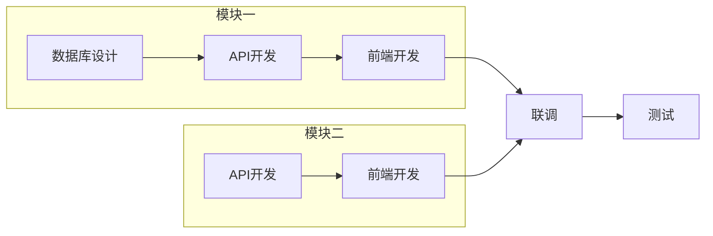

# 研发计划制定方法论

## 一、任务拆解方法论

### 1.1 功能点到任务的映射规则

每个功能点通常需要拆解为以下任务类型：

```
功能点
├── [database] 数据库设计与建表
├── [backend] 后端API开发
│   ├── 接口定义
│   ├── 业务逻辑实现
│   └── 数据访问层
├── [frontend] 前端页面开发
│   ├── UI组件实现
│   ├── 状态管理
│   └── API调用
├── [test] 测试用例编写
│   ├── 单元测试
│   └── 接口测试
└── [integration] 前后端联调
```

### 1.2 任务粒度判断标准

**过大的任务信号**:
- 描述中包含多个"和"、"并且"
- 涉及多个页面或模块
- 预估工时超过3天
- 难以定义单一验收标准

**过小的任务信号**:
- 预估工时少于2小时
- 可以被其他任务顺带完成
- 没有独立的业务价值

### 1.3 任务命名规范

格式: `[模块名] + [动作] + [对象]`

示例:
- ✅ `[用户模块] 实现登录接口`
- ✅ `[订单模块] 开发订单列表页面`
- ❌ `做登录功能`（太模糊）
- ❌ `用户模块开发`（太宽泛）

## 二、依赖关系分析方法

### 2.1 依赖类型定义

| 类型 | 代码 | 说明 | 示例 |
|------|------|------|------|
| 阻塞依赖 | blocks | 必须完成后才能开始 | 数据库设计 → API开发 |
| 软依赖 | soft | 建议先完成，但可并行 | 文档 → 开发 |
| 测试依赖 | test | 功能完成后才能测试 | 功能开发 → 测试用例 |
| 部署依赖 | deploy | 需要特定环境准备 | 环境配置 → 部署 |

### 2.2 常见依赖模式

**纵向依赖链（技术栈）**:
```
数据库设计
    ↓
后端API开发
    ↓
前端页面开发
    ↓
前后端联调
    ↓
测试验证
```

**横向依赖（功能间）**:
```
用户注册 ←──┐
    ↓       │ (共用用户表)
用户登录 ←──┤
    ↓       │
个人中心 ←──┘
```

**菱形依赖（汇聚）**:
```
API定义
   ↓
┌──┴──┐
后端   前端
└──┬──┘
   ↓
  联调
```

### 2.3 循环依赖检测与解决

**检测方法**: 拓扑排序，若无法完成排序则存在环

**解决策略**:
1. 重新审视任务边界，拆分任务
2. 引入接口Mock层解耦
3. 识别真正的依赖方向

## 三、工时估算方法

### 3.1 复杂度评估维度

| 维度 | 权重 | 评估要点 |
|------|------|----------|
| 代码量 | 30% | 预估代码行数 |
| 技术难度 | 25% | 是否涉及新技术、复杂算法 |
| 业务复杂度 | 20% | 业务逻辑是否复杂 |
| 联调复杂度 | 15% | 涉及多少系统/接口 |
| 风险系数 | 10% | 不确定性程度 |

### 3.2 工时计算公式

```
实际工时 = 纯开发工时 × (1 + 缓冲系数)

缓冲系数:
- 熟悉的技术栈: 0.2
- 一般熟悉度: 0.3
- 新技术栈: 0.5
- 高风险任务: 0.5-1.0
```

### 3.3 工时参考基准

| 任务类型 | S (简单) | M (中等) | L (复杂) | XL (超复杂) |
|----------|----------|----------|----------|-------------|
| CRUD接口 | 2h | 4h | 8h | 16h |
| 列表页面 | 4h | 8h | 16h | 24h |
| 表单页面 | 4h | 8h | 12h | 20h |
| 复杂交互 | 8h | 16h | 24h | 40h |
| 数据库设计 | 2h | 4h | 8h | 16h |
| 单元测试 | 2h | 4h | 8h | 16h |

## 四、排期优化方法

### 4.1 关键路径法（CPM）

1. 计算每个任务的最早开始时间（ES）
2. 计算每个任务的最晚开始时间（LS）
3. 关键路径 = ES == LS 的任务链
4. 关键路径上的任务不能延期，否则影响整体工期

### 4.2 资源平衡策略

**资源冲突处理优先级**:
1. 关键路径任务优先
2. 高优先级(P0)任务优先
3. 依赖下游任务多的优先
4. 工时短的任务优先（快速释放资源）

**资源负载均衡**:
```
理想负载 = 总工时 / (工期 × 资源数)
目标: 每个资源的负载波动控制在理想负载的 ±20%
```

### 4.3 并行度优化

**最大并行度计算**:
```
最大并行度 = 同一时间点可并行执行的任务数
理论最优工期 = 总工时 / 最大并行度
```

**提升并行度的方法**:
1. 前后端接口先行，使用Mock并行开发
2. 模块化设计，减少跨模块依赖
3. 测试左移，开发和测试并行

## 五、输出模板

### 5.1 YAML输出模板

```yaml
# 研发计划 - YAML格式
# 用途: 供AI/系统解析使用
# 版本: 1.0

metadata:
  plan_id: "PLAN-{需求ID}"
  prd_id: "PRD-{需求ID}"
  prd_title: "{需求标题}"
  version: "1.0"
  created_at: "{创建时间}"
  created_by: "plan-architect"
  start_date: "{开始日期}"
  end_date: "{结束日期}"
  total_workdays: {总工作日}

team:
  backend:
    count: {人数}
    hours_per_day: 8
  frontend:
    count: {人数}
    hours_per_day: 8
  test:
    count: {人数}
    hours_per_day: 8

features:
  - id: "FEAT-001"
    name: "{功能名称}"
    priority: "P0|P1|P2"
    tasks:
      - "TASK-001"
      - "TASK-002"

tasks:
  - id: "TASK-001"
    name: "{任务名称}"
    type: "backend|frontend|database|api|test|integration|deploy|docs|review"
    description: "{详细描述}"
    feature_id: "FEAT-001"
    priority: "P0|P1|P2"
    complexity: "S|M|L|XL"
    estimated_hours: {预估工时}
    assignee_role: "backend|frontend|test"
    dependencies:
      - task_id: "TASK-000"
        type: "blocks|soft|test"
    acceptance_criteria:
      - "{验收标准1}"
      - "{验收标准2}"
    tags:
      - "{标签}"
    schedule:
      start_date: "{开始日期}"
      end_date: "{结束日期}"
      workdays: {工作日数}

dependencies_graph:
  # 邻接表表示
  TASK-001:
    - target: "TASK-002"
      type: "blocks"
  TASK-002:
    - target: "TASK-003"
      type: "blocks"

milestones:
  - id: "M1"
    name: "技术方案评审"
    date: "{日期}"
    criteria:
      - "技术方案文档完成"
      - "评审会议完成"
    tasks:
      - "TASK-001"
  - id: "M2"
    name: "核心功能开发完成"
    date: "{日期}"
    criteria:
      - "核心功能可演示"
    tasks:
      - "TASK-002"
      - "TASK-003"

critical_path:
  - "TASK-001"
  - "TASK-002"
  - "TASK-005"
  total_days: {关键路径天数}

summary:
  total_tasks: {任务总数}
  total_hours: {总工时}
  total_workdays: {总工作日}
  by_type:
    backend: {后端任务数}
    frontend: {前端任务数}
    database: {数据库任务数}
    test: {测试任务数}
    integration: {联调任务数}
  by_priority:
    P0: {P0任务数}
    P1: {P1任务数}
    P2: {P2任务数}
  by_complexity:
    S: {S任务数}
    M: {M任务数}
    L: {L任务数}
    XL: {XL任务数}

risks:
  - id: "RISK-001"
    description: "{风险描述}"
    probability: "high|medium|low"
    impact: "high|medium|low"
    mitigation: "{缓解措施}"
    related_tasks:
      - "TASK-001"
```

### 5.2 Markdown输出模板

```markdown
# 研发计划: {需求标题}

---

## 文档信息

| 项目 | 内容 |
|------|------|
| 计划ID | PLAN-{需求ID} |
| 关联PRD | PRD-{需求ID} |
| 版本 | 1.0 |
| 创建时间 | {创建时间} |
| 计划周期 | {开始日期} ~ {结束日期} |
| 总工期 | {X} 工作日 |

---

## 计划概览

### 统计摘要

| 指标 | 数值 |
|------|------|
| 任务总数 | {N} |
| 总工时 | {X} 小时 |
| 后端任务 | {N} 个 |
| 前端任务 | {N} 个 |
| 测试任务 | {N} 个 |

### 团队配置

| 角色 | 人数 | 日工时 |
|------|------|--------|
| 后端开发 | {N} | 8h |
| 前端开发 | {N} | 8h |
| 测试 | {N} | 8h |

---

## 功能模块与任务

### 模块一: {模块名称}

#### FEAT-001: {功能名称}

| 任务ID | 任务名称 | 类型 | 复杂度 | 工时 | 依赖 |
|--------|----------|------|--------|------|------|
| TASK-001 | {任务名} | backend | M | 8h | - |
| TASK-002 | {任务名} | frontend | L | 16h | TASK-001 |

**任务详情**:

##### TASK-001: {任务名称}

- **类型**: 后端开发
- **优先级**: P0
- **复杂度**: M
- **预估工时**: 8小时
- **负责角色**: 后端开发
- **依赖任务**: 无
- **排期**: {开始日期} ~ {结束日期}
- **验收标准**:
  - [ ] {验收标准1}
  - [ ] {验收标准2}

---

## 依赖关系图



---

## 甘特图

```mermaid
gantt
    title 研发计划甘特图
    dateFormat  YYYY-MM-DD
    section 模块一
    数据库设计       :TASK-001, {开始日期}, 1d
    API开发          :TASK-002, after TASK-001, 2d
    前端开发         :TASK-003, after TASK-002, 3d
    section 模块二
    API开发          :TASK-004, {开始日期}, 2d
    前端开发         :TASK-005, after TASK-004, 2d
    section 联调测试
    前后端联调       :TASK-006, after TASK-003 TASK-005, 2d
    测试验证         :TASK-007, after TASK-006, 2d
```

---

## 里程碑

| 里程碑 | 日期 | 标志 | 关联任务 |
|--------|------|------|----------|
| M1: 技术评审 | {日期} | 技术方案完成 | TASK-001 |
| M2: 核心功能完成 | {日期} | 核心功能可演示 | TASK-002, TASK-003 |
| M3: 功能开发完成 | {日期} | 所有功能开发完成 | TASK-004, TASK-005 |
| M4: 测试完成 | {日期} | 测试用例全部通过 | TASK-007 |
| M5: 上线发布 | {日期} | 生产环境部署完成 | - |

---

## 关键路径

```
TASK-001 → TASK-002 → TASK-003 → TASK-006 → TASK-007
```

**关键路径工期**: {X} 工作日

> ⚠️ 关键路径上的任务不能延期，否则将影响整体交付时间

---

## 风险提示

| 风险ID | 风险描述 | 概率 | 影响 | 缓解措施 |
|--------|----------|------|------|----------|
| RISK-001 | {风险描述} | 中 | 高 | {缓解措施} |

---

## 资源需求

### 按周资源分配

| 周次 | 后端 | 前端 | 测试 | 备注 |
|------|------|------|------|------|
| W1 | 2人 | 1人 | 0人 | 后端先行 |
| W2 | 2人 | 2人 | 0人 | 前后端并行 |
| W3 | 1人 | 2人 | 1人 | 联调+测试介入 |

---

## 确认签署

- [ ] 产品经理确认需求范围
- [ ] 技术负责人确认技术方案
- [ ] 项目经理确认排期

**确认人**: _______________
**确认日期**: _______________

---

*此计划由 plan-architect Agent 自动生成*
```

## 六、最佳实践

### 6.1 任务拆解最佳实践

1. **遵循MECE原则**: 任务间相互独立，完全穷尽
2. **保持一致的粒度**: 同一层级任务复杂度相近
3. **明确验收标准**: 每个任务都有可测量的完成标准
4. **考虑技术债务**: 预留重构和代码优化时间

### 6.2 排期最佳实践

1. **预留缓冲时间**: 整体预留10-20%的缓冲
2. **避免资源过载**: 单人日负载不超过6小时有效编码
3. **考虑会议时间**: 每日预留1-2小时用于沟通
4. **节假日处理**: 避开法定节假日和团队假期

### 6.3 风险管理最佳实践

1. **识别技术风险**: 新技术、复杂算法、第三方依赖
2. **识别资源风险**: 关键人员依赖、技能缺口
3. **识别进度风险**: 依赖外部系统、审批流程
4. **制定应对策略**: 每个风险都有Plan B

## 七、与其他Agent的衔接

### 7.1 上游衔接

- **需求拆解Agent**: 接收PRD文档作为输入
- **产品目标价值Agent**: 参考优先级评估结果

### 7.2 下游衔接

- **开发执行**: 开发团队按计划执行任务
- **进度跟踪**: 可与项目管理工具集成
- **回顾复盘**: 计划与实际对比分析
