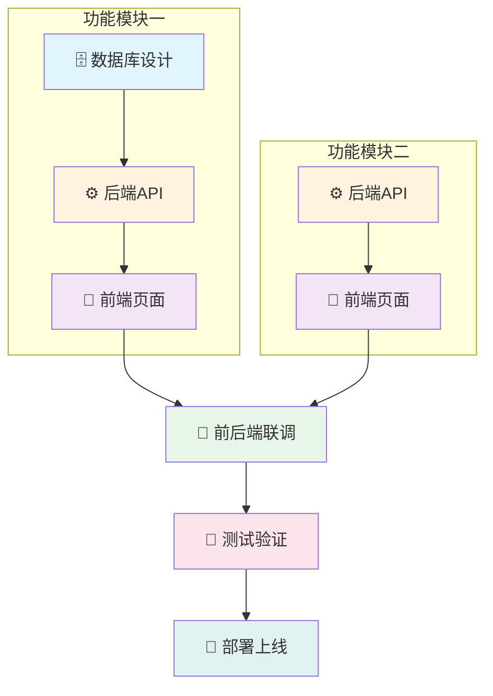

# 研发计划: {{prd_title}}

---

## 文档信息

| 项目 | 内容 |
|------|------|
| **计划ID** | {{plan_id}} |
| **关联PRD** | {{prd_id}} |
| **版本** | {{version}} |
| **创建时间** | {{created_at}} |
| **计划周期** | {{start_date}} ~ {{end_date}} |
| **总工期** | {{total_workdays}} 工作日 |
| **状态** | 🔵 草稿 |

---

## 一、计划概览

### 1.1 统计摘要

| 指标 | 数值 | 说明 |
|------|------|------|
| **任务总数** | {{total_tasks}} 个 | 全部可执行任务 |
| **总工时** | {{total_hours}} 小时 | 含缓冲时间 |
| **总工期** | {{total_workdays}} 天 | 工作日计算 |
| **关键路径** | {{critical_path_days}} 天 | 最短可交付时间 |

#### 按类型分布

| 类型 | 任务数 | 工时 | 占比 |
|------|--------|------|------|
| 🗄️ 数据库 | {{database_count}} | {{database_hours}}h | {{database_percent}}% |
| ⚙️ 后端 | {{backend_count}} | {{backend_hours}}h | {{backend_percent}}% |
| 🎨 前端 | {{frontend_count}} | {{frontend_hours}}h | {{frontend_percent}}% |
| 🧪 测试 | {{test_count}} | {{test_hours}}h | {{test_percent}}% |
| 🔗 联调 | {{integration_count}} | {{integration_hours}}h | {{integration_percent}}% |

#### 按优先级分布

| 优先级 | 任务数 | 说明 |
|--------|--------|------|
| 🔴 P0 | {{p0_count}} | 必须完成，阻塞发布 |
| 🟡 P1 | {{p1_count}} | 重要功能，尽量完成 |
| 🟢 P2 | {{p2_count}} | 锦上添花，可延期 |

### 1.2 团队配置

| 角色 | 人数 | 日工时 | 总可用工时 |
|------|------|--------|------------|
| 后端开发 | {{backend_team}} 人 | 8h | {{backend_available}}h |
| 前端开发 | {{frontend_team}} 人 | 8h | {{frontend_available}}h |
| 测试工程师 | {{test_team}} 人 | 8h | {{test_available}}h |
| 运维/DevOps | {{devops_team}} 人 | 8h | {{devops_available}}h |

---

## 二、功能模块与任务

{{#each features}}
### 2.{{index}}. {{name}}

> {{description}}

**优先级**: {{priority_badge}}
**验收标准**:
{{#each acceptance_criteria}}
- [ ] {{this}}
{{/each}}

#### 任务列表

| ID | 任务名称 | 类型 | 复杂度 | 工时 | 依赖 | 排期 |
|----|----------|------|--------|------|------|------|
{{#each tasks}}
| {{id}} | {{name}} | {{type_badge}} | {{complexity}} | {{hours}}h | {{dependencies}} | {{schedule}} |
{{/each}}

{{#each tasks}}
##### {{id}}: {{name}}

| 属性 | 值 |
|------|-----|
| **类型** | {{type_full}} |
| **优先级** | {{priority}} |
| **复杂度** | {{complexity}} ({{complexity_desc}}) |
| **预估工时** | {{estimated_hours}}h (含缓冲: {{total_hours}}h) |
| **负责角色** | {{assignee_role}} |
| **排期** | {{start_date}} → {{end_date}} |
| **关键路径** | {{critical_path_flag}} |

**任务描述**:
{{description}}

**依赖关系**:
{{#if dependencies}}
{{#each dependencies}}
- {{type_icon}} **{{task_id}}**: {{description}}
{{/each}}
{{else}}
- 无前置依赖
{{/if}}

**验收标准**:
{{#each acceptance_criteria}}
- [ ] {{this}}
{{/each}}

{{#if risks}}
**风险提示**:
{{#each risks}}
- ⚠️ {{this}}
{{/each}}
{{/if}}

---

{{/each}}
{{/each}}

## 三、依赖关系图



### 依赖类型说明

| 图标 | 类型 | 说明 |
|------|------|------|
| ⛔ | blocks | 阻塞依赖：必须先完成 |
| 🔄 | soft | 软依赖：建议先完成，可并行 |
| 🧪 | test | 测试依赖：需功能完成后测试 |
| 🚀 | deploy | 部署依赖：需环境准备 |

---

## 四、甘特图

```mermaid
gantt
    title 研发计划甘特图
    dateFormat YYYY-MM-DD
    excludes weekends

    section 里程碑
    M1-技术评审           :milestone, m1, {{m1_date}}, 0d
    M2-核心功能完成       :milestone, m2, {{m2_date}}, 0d
    M3-功能开发完成       :milestone, m3, {{m3_date}}, 0d
    M4-测试完成           :milestone, m4, {{m4_date}}, 0d
    M5-上线发布           :milestone, m5, {{m5_date}}, 0d

    section 模块一: 用户管理
    数据库设计            :TASK-001, {{start_date}}, 1d
    用户注册API           :TASK-002, after TASK-001, 2d
    用户登录API           :TASK-003, after TASK-001, 1d
    注册页面              :TASK-004, after TASK-002, 2d
    登录页面              :TASK-005, after TASK-003, 1d

    section 模块二: 核心功能
    核心API开发           :TASK-006, after TASK-002, 3d
    核心页面开发          :TASK-007, after TASK-006, 3d

    section 联调测试
    前后端联调            :TASK-008, after TASK-007, 2d
    功能测试              :TASK-009, after TASK-008, 3d
    Bug修复               :TASK-010, after TASK-009, 2d

    section 部署
    生产环境部署          :TASK-011, after TASK-010, 1d
```

---

## 五、里程碑

| 里程碑 | 日期 | 标志 | 关联任务 | 状态 |
|--------|------|------|----------|------|
| 🏁 M1: 技术方案评审 | {{m1_date}} | 技术方案文档完成、评审通过 | {{m1_tasks}} | ⏳ 待完成 |
| 🏁 M2: 核心功能完成 | {{m2_date}} | 核心功能可演示 | {{m2_tasks}} | ⏳ 待完成 |
| 🏁 M3: 功能开发完成 | {{m3_date}} | 所有功能开发完成 | {{m3_tasks}} | ⏳ 待完成 |
| 🏁 M4: 测试完成 | {{m4_date}} | 测试用例100%通过 | {{m4_tasks}} | ⏳ 待完成 |
| 🏁 M5: 上线发布 | {{m5_date}} | 生产环境部署成功 | {{m5_tasks}} | ⏳ 待完成 |

### 里程碑详情

#### M1: 技术方案评审 ({{m1_date}})

**完成标志**:
- [ ] 技术方案文档完成
- [ ] 数据库设计完成
- [ ] API接口定义完成
- [ ] 技术评审会议通过

**关联任务**: {{m1_tasks}}

---

## 六、关键路径

```
{{critical_path_visualization}}
```

**关键路径工期**: {{critical_path_days}} 工作日

> ⚠️ **重要提示**: 关键路径上的任务不能延期，任何延期都将直接影响整体交付时间。
>
> 关键路径上的任务需要：
> - 优先分配资源
> - 密切关注进度
> - 提前识别风险

### 关键任务清单

| 序号 | 任务ID | 任务名称 | 工期 | 累计工期 |
|------|--------|----------|------|----------|
{{#each critical_path_tasks}}
| {{index}} | {{id}} | {{name}} | {{days}}天 | {{cumulative}}天 |
{{/each}}

---

## 七、风险提示

| 风险ID | 风险描述 | 概率 | 影响 | 风险等级 | 缓解措施 |
|--------|----------|------|------|----------|----------|
{{#each risks}}
| {{id}} | {{description}} | {{probability}} | {{impact}} | {{risk_level}} | {{mitigation}} |
{{/each}}

### 风险详情

{{#each risks}}
#### {{id}}: {{description}}

| 属性 | 值 |
|------|-----|
| **类型** | {{category}} |
| **概率** | {{probability_badge}} |
| **影响** | {{impact_badge}} |
| **风险等级** | {{risk_level_badge}} |
| **关联任务** | {{related_tasks}} |

**缓解措施**:
{{mitigation}}

**应急预案**:
{{contingency}}

---

{{/each}}

## 八、资源分配

### 按周资源分配

| 周次 | 日期范围 | 后端 | 前端 | 测试 | 主要工作 |
|------|----------|------|------|------|----------|
{{#each weeks}}
| W{{index}} | {{date_range}} | {{backend}}人 | {{frontend}}人 | {{test}}人 | {{main_work}} |
{{/each}}

### 资源负载图

```
后端团队负载:
W1: ████████░░ 80%
W2: ██████████ 100%
W3: ██████░░░░ 60%
W4: ████░░░░░░ 40%

前端团队负载:
W1: ████░░░░░░ 40%
W2: ██████████ 100%
W3: ██████████ 100%
W4: ██████░░░░ 60%

测试团队负载:
W1: ░░░░░░░░░░ 0%
W2: ██░░░░░░░░ 20%
W3: ████████░░ 80%
W4: ██████████ 100%
```

---

## 九、确认签署

### 需求范围确认

- [ ] 所有功能点已覆盖
- [ ] 优先级分配合理
- [ ] 验收标准明确

**产品经理确认**:
签名: _______________  日期: _______________

### 技术方案确认

- [ ] 任务拆解合理
- [ ] 工时估算准确
- [ ] 依赖关系正确
- [ ] 技术风险可控

**技术负责人确认**:
签名: _______________  日期: _______________

### 排期确认

- [ ] 排期可行
- [ ] 资源充足
- [ ] 里程碑合理

**项目经理确认**:
签名: _______________  日期: _______________

---

## 十、变更记录

| 版本 | 日期 | 作者 | 变更内容 |
|------|------|------|----------|
| 1.0 | {{created_at}} | plan-architect | 初始版本创建 |

---

## 附录

### A. 任务ID索引

| 任务ID | 任务名称 | 所属功能 | 页码 |
|--------|----------|----------|------|
{{#each all_tasks}}
| {{id}} | {{name}} | {{feature}} | [跳转](#{{anchor}}) |
{{/each}}

### B. 术语说明

| 术语 | 说明 |
|------|------|
| 关键路径 | 项目中最长的任务序列，决定项目最短完成时间 |
| 阻塞依赖 | 前置任务必须100%完成才能开始后续任务 |
| 软依赖 | 建议先完成前置任务，但可以部分并行 |
| 工时 | 完成任务所需的实际工作时间（小时） |
| 工期 | 任务从开始到结束的日历时间（工作日） |

---

*此文档由 plan-architect Agent 自动生成*
*生成时间: {{generated_at}}*
