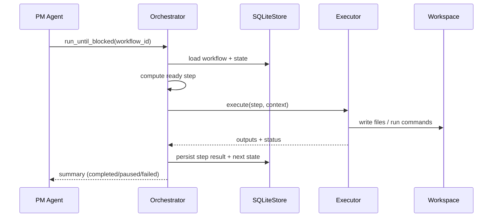

# LEE Orchestrator 执行架构（v3.x / spec-global）

> **文档版本**: v3.x（与代码同步演进）
> **最后更新**: 2026-02-06
> **范围**: 以当前仓库 `src/lee/orchestrator/` 与 `spec-global/` 为准

## 1. 设计目标

本架构的目标：

1. **将「流程控制」与「具体执行」彻底解耦**。
2. **保证 AI 无法绕过流程直接产生"有效副作用"**。
3. **支持多种执行形态**：LLM / MetaGPT / Skill / MCP / Shell。
4. **允许顶层 AI（PM agent）参与决策，但不拥有执行权**。
5. **在无 IDE / 无人值守的情况下，Orchestrator + Executors 仍可独立运行**（CLI / API 驱动）。
6. **以 spec-global 作为“可执行制度”**：workflow/agent/gate/contract/skill 全部外置为规范文件。

---

## 2. 核心原则

### P1. Orchestrator 只负责编排，不执行具体工作

Orchestrator 不负责任何业务逻辑，只负责：

- 解析 workflow template（来自 `spec-global/**/workflows/**/workflow.yaml` 等）
- 维护 workflow state（ready / running / completed / paused / failed）
- 决定「下一步该跑哪个 step」
- 将 step 转交给对应的 Executor
- 记录 step 执行结果与 artifacts（**SQLite 为唯一状态权威**）

Orchestrator **不直接**：

- 调用 LLM / MetaGPT API
- 跑测试 / 构建 / 部署
- 调用 Figma / CI / K8s 等外部系统

这些由 Executor + Skill/MCP 层完成。

---

### P2. 所有"有效副作用"只能通过 Orchestrator 发生

系统只承认以下行为是"真实发生过的"：

- Orchestrator 将某个 step 标记为 `completed` / `failed` / `paused`。
- Orchestrator 在 SQLite 状态中记录该 step 的 `outputs`（写入文件、执行日志摘要等）。
- Orchestrator 记录门禁（gate）审批与阻塞原因（human-in-the-loop）。

任何**未经过 Orchestrator 的行为**（包括 AI 在对话中"声称已经做完某事"）：

> **一律视为无效，不进入系统状态。**

---

### P3. 顶层 AI = 决策者，不是执行者

- 顶层 AI（PM Agent）只负责"看状态 + 做决策"。
- 顶层 AI 只能通过 CLI/API 调用 Orchestrator（或通过 IDE 的 tool-wrapper 间接调用）。
- 顶层 AI **不直接**：
  - 写项目文件
  - 调 shell / CI / K8s
  - 调 LLM / MetaGPT 生成最终产物
- 顶层 AI 不能自行判定 step 完成情况，完成与否以 Orchestrator 的 state 为准。

---

## 3. 分层架构总览

### 3.1 系统架构图（最新）

```mermaid
flowchart TB
  Human[Human / Developer]:::actor
  PM[PM Agent<br/>(Codex CLI / Claude Code)]:::actor

  subgraph Spec["Spec Layer (spec-global/)"]
    WF["workflows/**/workflow.yaml"]:::spec
    AG["agents/**/agent.yaml"]:::spec
    GT["gates/**/gate.yaml"]:::spec
    CT["contracts/**/schema.json"]:::spec
    SK["skills/**"]:::spec
  end

  subgraph Orch["LEE Orchestrator (src/lee/orchestrator)"]
    TM[TemplateManager]:::orch
    SGP[SpecGlobalParser + IRConverter]:::orch
    SM[WorkflowStateMachine]:::orch
    GE[GateEngine / Human Gate]:::orch
    ACB[AgentContextBuilder]:::orch
    EXF[ExecutorFactory]:::orch
    DB[(SQLiteStore)]:::store
    OFH[FileOutputHandler]:::orch
  end

  subgraph Exec["Executors"]
    LLM[LLMExecutor]:::exec
    SH[ShellExecutor]:::exec
    MG[MetaGPTExecutor]:::exec
  end

  subgraph Ext["External Systems"]
    LLMAPI["LLM Providers (OpenAI/Claude/...)"]:::ext
    OS["Shell / CI / local tools"]:::ext
    MCP["MCP Servers / HTTP APIs"]:::ext
  end

  subgraph WS["Workspace (Project)"]
    OUT["Artifacts / output/ ..."]:::ws
    REPO["Codebase / Docs / Specs"]:::ws
  end

  PM -->|CLI/API| Orch
  Human -->|approve / feedback| GE

  WF --> TM
  AG --> ACB
  GT --> GE
  CT --> TM
  SK --> EXF

  TM --> SGP --> TM
  TM --> SM
  SM <--> DB
  SM --> GE
  SM -->|ready step| EXF
  EXF --> LLM --> LLMAPI
  EXF --> SH --> OS
  EXF --> MG --> LLMAPI
  SH --> MCP
  LLM --> OFH --> OUT
  SH --> OFH --> OUT
  REPO --- OUT

  classDef actor fill:#fff,stroke:#555,stroke-width:1px;
  classDef spec fill:#f8f9ff,stroke:#5a67d8,stroke-width:1px;
  classDef orch fill:#f0fff4,stroke:#2f855a,stroke-width:1px;
  classDef exec fill:#fffaf0,stroke:#b7791f,stroke-width:1px;
  classDef store fill:#f7fafc,stroke:#2d3748,stroke-width:1px;
  classDef ext fill:#fff5f5,stroke:#c53030,stroke-width:1px;
  classDef ws fill:#f7fafc,stroke:#4a5568,stroke-width:1px;
```

### 3.2 控制流（概念序列图）



---

## 4. 关键组件职责

### 4.1 PM Agent（顶层大模型）

**定位**：唯一的大脑（项目 PM / Supervisor）。

**职责**：

* 读取项目状态摘要：
  * 当前 workflow 步骤列表与状态
  * 已完成步骤的主要产物摘要
* 规划或选择下一步动作：
  * 跑哪个 step
  * 等待人类决策 / 进入 human gate
  * 结束当前 phase
* 通过 tools 调用 Orchestrator：
  * `orchestrator_get_state`
  * `orchestrator_run_step`
  * `orchestrator_next`

**约束**：

* 不直接写项目目录中的文件。
* 不直接执行 shell / CI / K8s / MCP。
* 不自行判定某个 step 已完成。

**输出协议**：详见 `PM_AGENT_PROTOCOL.md`。

---

### 4.2 Orchestrator（`lee.orchestrator`）

**定位**：流程控制系统（公司制度 / 审批流）。

**主要职责**：

1. **加载项目 state**
   * 从 SQLite（`SQLiteStore`）读取 workflow 实例、执行记录、门禁状态。
2. **加载与解析 workflow template**
   * `TemplateManager` 从 `spec-global/` 加载 `workflow.yaml`（支持 spec-global 格式与兼容格式）。
   * spec-global 格式：`SpecGlobalParser` → `WorkflowIR` → `IRConverter` → `WorkflowTemplate`。
3. **确定 ready steps**
   * 基于依赖关系、条件（condition）、以及 human gate 的阻塞状态。
4. **构造 Agent/Skill 上下文**
   * `AgentContextBuilder` 负责加载 agent spec、拼接 prompt/context、注入输入产物引用等。
5. **调用 Executor 执行**
   * `ExecutorFactory.create("llm"|"shell"|"metagpt")`
6. **更新 state 与产物记录（SQLite）**
   * 标记 step 状态（`completed/failed`）。
   * 记录 `outputs`（写入文件路径、stdout/stderr 摘要、结构化输出等）。
   * human gate：暂停工作流并创建 gate 记录，等待审批后恢复执行。

**Orchestrator 不关心**：

* LLM provider / 模型种类。
* Skill 如何连接外部系统。
* MCP server 实现细节。

---

### 4.3 Engine / Executor 层

**定位**：面向 Orchestrator 的执行适配层。

**统一接口**：

```python
async def execute(input_data: dict) -> dict:
    ...
```

（当前实现以 `input_data/output_data` 为主；编排与状态写入仍由 Orchestrator 负责。）

**常见 Executor 类型**：

| Executor           | 用途                      |
| ------------------ | ----------------------- |
| LLMExecutor        | 文本 / 代码 / 分析类工作         |
| MetaGPTExecutor    | 多角色、重型开发任务              |
| ShellExecutor      | pytest / build / script |
| MCP (via Shell/HTTP) | CI / Figma / K8s 等（通过 Skill/MCP 适配） |

Executor **只能被 Orchestrator 调用**。

---

### 4.4 Skill / MCP

**定位**：与真实世界交互的"确定性动作单元"。

Skill 可以是：

* 本地脚本（shell / python）
* 远端 HTTP 调用
* MCP server 的某个 tool

**特点**：

* 有明确的输入 / 输出。
* 行为可预期、可重复。
* 不直接由 PM agent 调用，只能被 Executor 调用。

---

## 5. Spec 建模规范

### 5.1 spec-global Workflow（示例）

```yaml
# spec-global/departments/dev/workflows/bug-fix/v1/workflow.yaml
kind: workflow
id: workflow.dev.bug_fix
version: 1.1

stages:
  - id: s1_reproduce
    steps:
      - id: s1_1_reproduce_bug
        type: agent
        run: agent.dev.bug_reproducer
        inputs:
          - bug_contract: "bugs/*.contract.yaml"
        outputs:
          - path: "output/repro-result.yaml"

  - id: s3_fix_plan
    steps:
      - id: s3_3_fix_plan_gate
        type: gate_decision
        gate:
          ref: gate.dev.bugfix_plan_gate
```

### 5.2 Agent Spec（示例）

```yaml
# spec-global/departments/ui/agents/prototype-designer/v1/agent.yaml
kind: agent
id: agent.design.prototype
name: Prototype Designer
version: 1.1

persona:
  role: "原型设计师"

prompting:
  system: |
    You are a Prototype Designer...
```

### 5.3 Skill Spec（示例）

```yaml
# （仓库内 skill 规范随部门存放；执行侧通过 Shell/MCP 适配）
# spec-global/**/skills/**.yaml
```

---

## 6. IDE / Agent Host 的定位与边界

Codex CLI / Claude Code / 其他 IDE Agent Host 在本架构中的角色：

* 顶层 PM Agent 的运行环境（IDE + 对话）。
* 提供调用 Orchestrator 的入口（CLI/API/tool-wrapper）。
* 提供人类协作入口（human gate 决策、查看日志等）。

IDE Agent Host **不是**：

* Orchestrator 的一部分。
* Executor 的一部分。
* 系统运行的必需组件。

**未来可以将 PM Agent 从 IDE 迁出，改为服务端调用 LLM API，但 Orchestrator + Executor 的架构不变。**

---

## 7. AI 需要理解什么？

* AI 不需要理解整个架构细节。
* AI 只需要通过 system prompt 理解：

  1. 自己是 PM / Supervisor 角色；
  2. 自己只能输出 action / 调用 orchestrator 工具；
  3. 自己不能直接执行步骤或修改项目文件。

所有这些在 `PM_AGENT_PROTOCOL.md` 中以"使用说明 + 约束"的形式呈现即可。

---

## 8. Executor 双引擎架构（v3.1 新增）

LEE 采用**渐进式替换策略**：当前引擎与下一代 LangGraph 引擎并行运行。

### 8.1 引擎对比

| 维度 | 当前引擎 (`orchestrator/execution/`) | 下一代引擎 (`runtime/executor/`) |
|:----:|:----:|:----:|
| **定位** | 生产引擎 | 下一代引擎 (v0.1.0) |
| **调度模型** | StateMachine + step-by-step | LangGraph graph.invoke() |
| **Executor 类型** | llm / shell / metagpt / mock | l3.impl.coding / l3.test.unit |
| **数据契约** | `Dict[str, Any]` (松散) | `ExecutorTaskSpec` / `ExecutionResult` (强类型) |
| **追踪** | `trace.py` + `tracing_integration.py` | `SpanBuilder` |
| **安全** | ToolGuard (token_manager) | `security.py` + `allowed_write_patterns` |
| **代码量** | ~323K (26 files) | ~50K (14 files) |

### 8.2 适配器桥接

`langgraph_executor.py` 桥接两套引擎，在 `orchestrator.py` 启动时注册：

```
ExecutorFactory
    ├── "llm"       → LLMExecutor        当前引擎
    ├── "shell"     → ShellExecutor       当前引擎
    ├── "metagpt"   → MetaGPTExecutor     当前引擎
    └── "langgraph" → LangGraphExecutor   适配器
                         ↓ (桥接)
                     runtime/executor/run_task()
                         ├── graphs/impl_coding   l3.impl.coding
                         ├── graphs/unit_test     l3.test.unit
                         ├── tools/               LLM / FS / Shell / Security
                         └── tracing/             SpanBuilder
```

Workflow YAML 用法：
```yaml
steps:
  - name: implement_code
    executor: langgraph
    execution_context:
      task_type: l3.impl.coding
```

### 8.3 迁移路线图

| 阶段 | 内容 | 状态 |
|:----:|------|:----:|
| Phase 0 | 适配器实现 + 注册 | ✅ 完成 |
| Phase 1 | l3.impl.coding + l3.test.unit graph | ✅ 完成 |
| Phase 2 | 集成测试 | ⬜ 待做 |
| Phase 3 | 更多 graph (l3.review, l3.deploy) | ⬜ 待做 |
| Phase 4 | 统一追踪到 SpanBuilder | ⬜ 待做 |
| Phase 5 | 全面切换，retire 当前引擎 | ⬜ 远期 |

### 8.4 开发者指南：何时用哪个引擎

| 场景 | executor 类型 | 理由 |
|------|:----:|------|
| L1/L2 Agent 步骤 | `llm` | 成熟稳定 |
| L3 代码实现 | `langgraph` + `task_type: l3.impl.coding` | LangGraph DAG |
| L3 单元测试 | `langgraph` + `task_type: l3.test.unit` | 同上 |
| Shell 脚本 | `shell` | 直接执行 |
| MetaGPT 团队任务 | `metagpt` | 多角色 |

新增 Graph Builder：
```python
from lee.runtime.executor import register_graph
def build_my_graph(task: ExecutorTaskSpec) -> StateGraph: ...
register_graph("l3.my_task", build_my_graph)
```

---

## 9. 现状说明（与 spec 对齐度）

- `spec-global` 已包含 `gate_decision/decision/conditional` 等 step 类型；当前执行器侧以 `agent/skill/human_gate` 为主，其他类型需要补齐专用执行路径（或在 IR 转换层做降级/展开）。
- `AgentLoader` 的默认 `spec_root` 仍兼容旧路径（`ai-spec/`）；在 spec-global 迁移场景下应显式配置为仓库内 `spec-global/`。
- v3.1: LangGraph 执行器已注册到 ExecutorFactory，L3 workflow 可使用 `executor: langgraph`。

---

**维护者**: LEE 框架团队（docs + spec-global + orchestrator）
