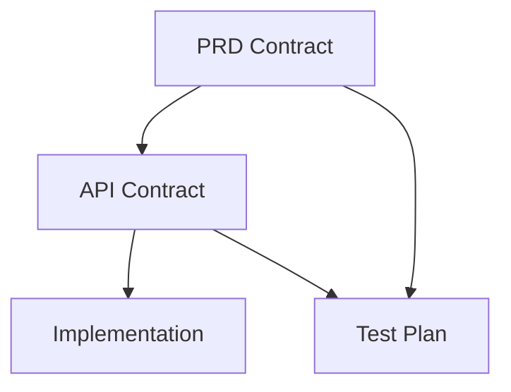

# 技术债文档 - SSOT v1.0/v1.5

**创建日期**: 2026-03-01
**版本**: SSOT v1.5
**状态**: 核心功能完成，待增强功能列入技术债

---

## 1. 概述

本文档记录 SSOT 真理链管理系统中已识别但尚未实现的功能和改进项。这些技术债按优先级分为 P0（高）、P1（中）、P2（低）三个等级。

### 1.1 当前状态

| 模块 | 状态 | 测试覆盖率 |
|------|------|-----------|
| SSOT Service | ✅ 完成 | 100% |
| Context Builder | ✅ 完成 | 100% |
| Task Brief | ✅ 完成 | 100% |
| Artifact Manager | ✅ 完成 | 100% |
| Registry | ✅ 完成 | 100% |
| Manifest Manager | ✅ 完成 | 100% |
| CLI Commands | ✅ 完成 | 100% |
| Gate Integration | ✅ 完成 | 100% |

**总测试覆盖率**: 189 测试用例，100% 通过

---

## 2. 技术债清单

### 2.1 P0 高优先级

#### [P0-QA-01] QA L2/L3 工作流 Week 2 核心功能

**描述**: 实现 QA L2/L3 工作流升级的 Week 2 核心功能（P1 级别）。

**现状**:
- ✅ Week 1 完成：模板版本化（v1.1/v2.1）、Test Runner per-case evidence 增强
- ⚠️ Week 2 待实现：enforce 模式、env_check 阻断、依赖调度

**待完成**:
- [ ] **behavior_compliance enforce 模式**
  - 文件：`src/lee/orchestrator/verifiers/behavior_compliance.py`
  - 添加环境白名单机制：`WARN_ONLY_ENVIRONMENTS = ["dev", "test", "local"]`
  - 生产环境强制 enforce
  - 添加 invalid_run_reason 枚举映射
  - 单元测试：`tests/verifiers/test_behavior_compliance_enforce.py`
  - 集成测试：`tests/integration/test_enforce_mode.py`

- [ ] **env_check 强制阻断**
  - 文件：`src/lee/orchestrator/execution/orchestrator.py`
  - 在 test_set_execution 前检查 env_check_result
  - env_check 失败时阻断 L3 spawn
  - 单元测试：`tests/orchestrator/test_env_check_blocking.py`
  - 集成测试：`tests/integration/test_env_check_blocking.py`

- [ ] **Test Set 依赖调度**
  - 文件：`src/lee/orchestrator/execution/orchestrator.py`
  - 实现拓扑排序算法：`topological_sort(test_sets)`
  - 实现依赖失败跳过逻辑：`should_skip_due_to_dependency()`
  - 串行执行 L3 实例
  - 单元测试：`tests/orchestrator/test_topological_sort.py`, `tests/orchestrator/test_dependency_skip.py`
  - 集成测试：`tests/integration/test_dependency_execution.py`

**影响**: QA 测试执行治理能力

**预估工作量**: 3-5 天

**参考文档**:
- `spec-global/departments/qa/docs/qa-workflow-implementation-plan.md`
- `spec-global/departments/qa/workflows/templates/test-set-l3-template-v1.1.yaml`
- `spec-global/departments/qa/workflows/templates/test-plan-l2-template-v2.1.yaml`

---

#### [P0-QA-02] QA L2/L3 工作流 Week 3-4 增强功能

**描述**: 实现 QA L2/L3 工作流的高级功能（P2/P3 级别）。

**现状**:
- Week 1-2 核心功能完成后实施

**待完成**:
- [ ] **L3 Output Validation**
  - 新建 `src/lee/orchestrator/execution/l3_output_validator.py`
  - 实现 schema 验证（必需字段检查）
  - 实现 status 枚举验证
  - 实现 evidence 关联验证

- [ ] **State Machine 扩展**
  - 文件：`src/lee/orchestrator/storage/models.py`
  - 扩展 WorkflowStatus 枚举：添加 `INVALID_RUN = "invalid_run"`

- [ ] **Metrics 上报**
  - 新建 `src/lee/orchestrator/metrics/qa_metrics.py`
  - 实现 L3 级别指标：l3_execution_duration, invalid_run_total
  - 实现 L2 级别指标：l2_execution_duration

- [ ] **Artifact Registry 集成**
- [ ] **Human Gate 完整实现**
- [ ] **Tracing 集成**

**影响**: QA 测试可观测性、完整性

**预估工作量**: 5-7 天

---

### 2.2 P1 中优先级

#### [P0-01] Gate 审批与 CI/CD 集成

**描述**: 实现 Gate 审批与外部 CI/CD 系统（如 Jenkins、GitHub Actions）的集成。

**现状**:
- Gate 审批逻辑已在 `GateArtifactHandler.approve_gate_artifacts()` 中实现
- SSOT 校验功能正常工作
- 缺少与外部 CI/CD 系统的 webhook 通知

**待完成**:
- [ ] 实现 webhook 通知机制
- [ ] 添加 CI/CD 状态回调接口
- [ ] 支持 GitHub Status API
- [ ] 支持 Jenkins Pipeline 集成

**影响**: 生产环境部署自动化

**预估工作量**: 3-5 天

---

#### [P0-02] 大型项目性能优化

**描述**: 优化 Registry 加载性能，支持大型项目（1000+ artifacts）。

**现状**:
- `registry.rebuild()` 扫描所有 manifest.yaml 文件
- 每次 CLI 命令执行时可能需要重建索引
- 大型项目加载时间可能超过 10 秒

**待完成**:
- [ ] 实现增量索引更新
- [ ] 添加索引缓存机制
- [ ] 支持懒加载（按需加载 artifacts）
- [ ] 实现索引压缩存储

**影响**: 大型项目用户体验

**预估工作量**: 5-7 天

---

### 2.2 P1 中优先级

#### [P1-01] SSOT 真理链可视化

**描述**: 实现真理链的图形化展示功能。

**现状**:
- `lee ssot show-chain` 提供文本格式输出
- 支持表格和 JSON 格式
- 缺少图形化展示

**待完成**:
- [ ] 实现 Mermaid 格式输出
- [ ] 支持 GraphViz DOT 格式
- [ ] 添加 Web UI 展示（可选）
- [ ] 支持导出为图片（PNG/SVG）

**影响**: 用户体验、演示效果

**预估工作量**: 2-3 天

**示例输出**:


---

#### [P1-02] 批量操作支持

**描述**: 添加批量操作支持，减少重复 CLI 调用。

**现状**:
- 每次只能处理一个 artifact 或一个 run
- 批量操作需要多次调用 CLI

**待完成**:
- [ ] `lee ssot validate --run-id id1,id2,id3` 支持多个 run
- [ ] `lee ssot build-index --all-releases` 构建所有 release 索引
- [ ] `lee context list --limit 50` 支持分页
- [ ] 批量导出/导入 artifacts

**影响**: 操作效率

**预估工作量**: 2-3 天

---

#### [P1-03] 增量校验优化

**描述**: 实现增量 SSOT 校验，避免全量扫描。

**现状**:
- `service.validate()` 每次都扫描所有 artifacts
- 无法利用之前的校验结果

**待完成**:
- [ ] 实现变更检测（基于文件时间戳）
- [ ] 缓存校验结果
- [ ] 仅校验变更的 artifacts
- [ ] 支持校验历史查询

**影响**: 校验性能

**预估工作量**: 3-4 天

---

### 2.3 P2 低优先级

#### [P2-01] 用户使用文档完善

**描述**: 完善用户使用文档，添加更多示例和教程。

**现状**:
- 已有基础用户指南、API 参考、最佳实践
- 缺少视频教程和交互示例

**待完成**:
- [ ] 添加视频教程
- [ ] 创建交互式示例（Jupyter Notebook）
- [ ] 编写常见问题 FAQ
- [ ] 添加故障排查手册

**影响**: 新用户上手体验

**预估工作量**: 3-5 天

---

#### [P2-02] API 参考文档完善

**描述**: 完善 API 参考文档，添加更多代码示例。

**现状**:
- 已有基础 API 参考文档
- 部分方法缺少详细示例

**待完成**:
- [ ] 为每个方法添加完整示例
- [ ] 添加错误处理示例
- [ ] 添加边界条件说明
- [ ] 生成在线 API 文档（如 Sphinx）

**影响**: 开发者体验

**预估工作量**: 2-3 天

---

#### [P2-03] 缓存策略优化

**描述**: 优化缓存策略，减少不必要的文件 I/O。

**现状**:
- Registry 使用文件锁保证并发安全
- 每次修改都写盘

**待完成**:
- [ ] 实现内存缓存
- [ ] 添加缓存过期策略
- [ ] 支持缓存预热
- [ ] 优化文件锁粒度

**影响**: 性能优化

**预估工作量**: 2-3 天

---

#### [P2-04] 高级 SSOT 规则

**描述**: 实现更复杂的 SSOT 校验规则。

**现状**:
- v1.0 规则：基础的 derived_from/implements/verifies 校验
- v1.5 规则：增强版本（部分已实现）

**待完成**:
- [ ] 循环依赖检测
- [ ] 版本兼容性校验
- [ ] 跨项目依赖校验
- [ ] 自定义规则引擎

**影响**: 校验能力

**预估工作量**: 4-6 天

---

#### [P2-05] Webhook 通知机制

**描述**: 实现事件通知机制。

**现状**:
- 无事件通知功能

**待完成**:
- [ ] artifact 创建事件
- [ ] artifact 冻结事件
- [ ] Gate 审批事件
- [ ] SSOT 校验失败事件

**影响**: 集成能力

**预估工作量**: 2-3 天

---

## 3. 技术债优先级矩阵

```
        高
        │
  影响  │  P0-01      P0-02
        │  Gate 集成   性能优化
        │
        │  P1-01      P1-02      P1-03
        │  可视化     批量操作   增量校验
        │
        │  P2-01      P2-02      P2-03      P2-04      P2-05
        │  文档       API 文档    缓存       规则       Webhook
        │
        └──────────────────────────────────────────────→
                低              实现难度              高
```

---

## 4. 实施建议

### 4.1 短期（1-2 周）

1. **完成 P0 高优先级项目**
   - [P0-01] Gate 审批与 CI/CD 集成
   - [P0-02] 大型项目性能优化

### 4.2 中期（1 个月）

2. **完成 P1 中优先级项目**
   - [P1-01] SSOT 真理链可视化
   - [P1-02] 批量操作支持
   - [P1-03] 增量校验优化

### 4.3 长期（3 个月）

3. **完成 P2 低优先级项目**
   - [P2-01] 用户使用文档完善
   - [P2-02] API 参考文档完善
   - [P2-03] 缓存策略优化
   - [P2-04] 高级 SSOT 规则
   - [P2-05] Webhook 通知机制

---

## 5. 已知限制

### 5.1 技术限制

| 限制 | 说明 | 临时解决方案 |
|------|------|-------------|
| Windows fcntl 支持 | 已修复，但仅跳过文件锁 | 单进程环境无影响 |
| Registry 加载性能 | 大项目加载慢 | 定期构建索引 |
| 并发写入 | 使用文件锁保护 | 避免并发写入 |

### 5.2 功能限制

| 限制 | 说明 | 影响 |
|------|------|------|
| 无 Web UI | 仅 CLI 界面 | 需要命令行操作 |
| 无图形化展示 | 文本格式输出 | 无法直观查看链条 |
| 无实时通知 | 无 webhook 支持 | 需要轮询状态 |

---

## 6. 变更记录

| 日期 | 变更内容 | 负责人 |
|------|---------|--------|
| 2026-03-01 | 初始版本，记录 SSOT v1.0/v1.5 技术债 | - |
| 2026-03-03 | 添加 QA L2/L3 工作流技术债（P0-QA-01, P0-QA-02） | Claude |

---

## 7. 参考文档

- [SSOT 用户指南](SSOT_USER_GUIDE.md)
- [SSOT API 参考](SSOT_API_REFERENCE.md)
- [SSOT 最佳实践](SSOT_BEST_PRACTICES.md)
- [产出物管理系统架构](../../architecture/artifact-management-system.md)
