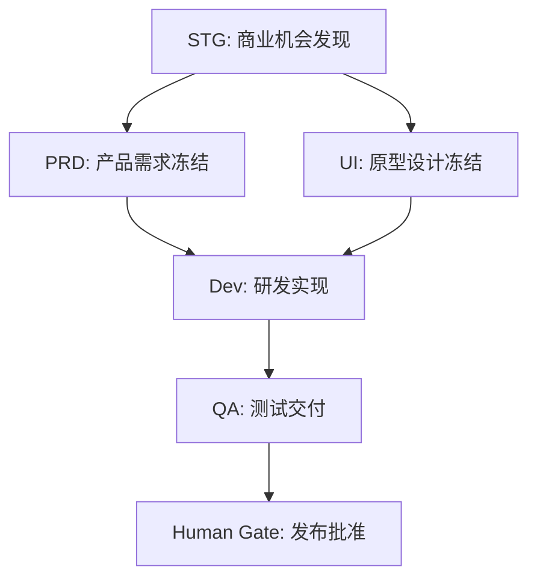
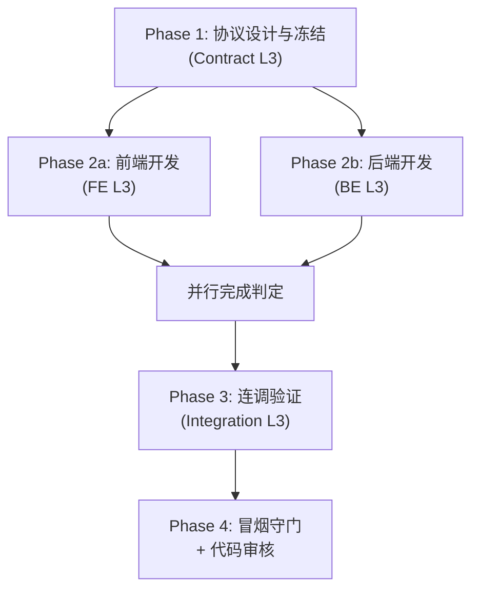

# LEE 工作流使用指南

> **版本**: v1.0 | **更新日期**: 2026-02-15 | **适用 LEE 版本**: v2.x

本文档详细说明 LEE 框架中的 **全部 16 个工作流**。每个工作流提供：用途、阶段拆解、CLI 调用示例、输入/输出说明，以及常见问题处理。

---

## 目录

| 部门 | 工作流 | 层级 | 说明 |
|------|--------|------|------|
| [Cross](#1-cross-产品-mvp-工作流) | product-mvp | L1 | 跨部门产品 MVP 主流程 |
| [STG](#2-stg-商业机会发现工作流) | opportunity-discovery | L2 | 商业机会发现 |
| [PRD](#3-prd-产品需求流水线) | product-pipeline | L2 | 需求→冻结 |
| [PRD](#4-prd-产品到研发全流程) | product-to-dev-pipeline | L2 | 需求→研发冻结包 |
| [UI](#5-ui-设计流水线) | ui-design-pipeline | L2 | UI 契约→冻结包 |
| [Dev](#6-dev-feature-开发主工作流) | feature (L2) | L2 | 特性开发主流程 |
| [Dev](#7-dev-协议设计子流程) | feature-contract-l3 | L3 | 协议设计与冻结 |
| [Dev](#8-dev-后端开发子流程) | feature-be-l3 | L3 | 后端 TDD 实现 |
| [Dev](#9-dev-前端开发子流程) | feature-fe-l3 | L3 | 前端 TDD 实现 |
| [Dev](#10-dev-联调验证子流程) | feature-integration-l3 | L3 | 前后端联调验证 |
| [Dev](#11-dev-bug-修复工作流) | bug-fix | L3 | Bug 分流→修复→提交 |
| [DevOps](#12-devops-部署工作流) | deploy | L3 | 部署→健康→冒烟→审批 |
| [QA](#13-qa-test-set-生产工作流) | test-set-production | L3 | 生产测试设计资产 |
| [QA](#14-qa-test-plan-执行工作流) | test-plan-execution | L3 | 执行测试计划 |
| [Media](#15-media-内容排版流水线) | content-layout-pipeline | L3 | 原始文章→平台就绪 |
| [Media](#16-media-结构图插入流水线) | diagram-insertion-pipeline | L3 | 为成稿配结构图 |

---

## 层级说明

LEE 采用 **L1 / L2 / L3** 三层编排架构：

```
L1（编联层）: 跨部门串联，只负责编排，不做具体工作
  └── L2（执行层）: 部门级流程，编排多个 L3 子流程
       └── L3（操作层）: 具体执行步骤，包含 Agent/Skill/Gate
```

- **冻结包（Freeze Package）** 是部门间交接的唯一合法形式
- 上游 L2 未完成，下游 L2 不得启动

---

## 已注册到 CLI 的工作流

以下工作流已在 `config/workflow-registry.yaml` 中注册，可直接通过 `lee run` 调用：

| 注册键 | 必填参数 | 可选参数 |
|--------|----------|----------|
| `dev.feature` | `--spec` | - |
| `dev.bugfix` | `--spec` | - |
| `qa.regression` | `--spec` | - |
| `devops.deploy` | `--env`, `--version` | - |
| `qa.test-set-production` | `--module`, `--requirement-doc` | `--tech-design` |
| `qa.test-plan-execution` | `--test-plan-id`, `--build-version`, `--build-commit` | `--environment` |

---

## 1. Cross: 产品 MVP 工作流

**文件**: `spec-global/cross/workflows/project/product-mvp/v1/workflow.yaml`
**版本**: v1.0 | **层级**: L1 | **执行模式**: 串行

### 用途

跨部门产品 MVP 开发主流程。通过 `workflow_spawn` 串联 5 个部门的 L2 流程，加上最终人类发布批准门禁。

### 流程图



### 冻结包流转

| 冻结包 | 生产方 | 消费方 | 必需字段 |
|--------|--------|--------|----------|
| 商业机会冻结包 | STG | PRD, UI | one_liner, target_user, why_now, differentiation, reasons_not_to_do |
| 研发冻结包 | PRD | Dev | requirements, acceptance_criteria, technical_specs, api_contracts |
| 原型冻结包 | UI | Dev | design_system, page_flows, component_specs, interaction_patterns |
| 提测冻结包 | Dev | QA | source_code, test_report, deployment_guide, known_issues |
| 可交付版本 | QA | Release | release_version, test_summary, bug_report, quality_metrics |

### 示例

```bash
# 目前未直接注册在 CLI，需要通过 Orchestrator API 或手动触发
# 典型使用方式：由 PM 在项目启动时触发 L1 工作流
lee workflow create \
  --workflow-id workflow.cross.product_mvp \
  --project-dir ./my-project
```

### 超时配置

- STG 商业机会发现：14 天
- PRD 需求冻结：7 天
- UI 原型设计：7 天
- Dev 研发实现：14 天
- QA 测试交付：7 天
- 发布批准门禁：1 天

---

## 2. STG: 商业机会发现工作流

**文件**: `spec-global/departments/stg/workflows/opportunity_discovery/v1/workflow.yaml`
**版本**: v1.1 | **层级**: L2 | **执行模式**: 部分并行

### 用途

从市场信号采集到商业机会冻结的 **6 层流水线**。核心输出为「商业机会冻结包」，作为下游 PRD/UI 的输入。

### 阶段详解

| # | 阶段 | 类型 | 执行者 | 说明 |
|---|------|------|--------|------|
| 1 | 搜索采集 | Agent | `agent.stg.search_signal_collector` | 采集市场搜索信号（关键词、趋势、量级） |
| 2 | 用户信号分析 | Agent | `agent.stg.user_signal_analyst` | 分析搜索意图，推断用户类型和痛点 |
| 3 | 行业结构分析 | Agent | `agent.stg.industry_structure_analyst` | 评估行业成熟度和进入壁垒 |
| 4 | 供给竞争分析 | Agent | `agent.stg.supply_competition_analyst` | 分析已有方案，识别空缺 |
| 5 | 市场信号冻结 | Human Gate | 策略部门负责人 | 冻结分析层结论（需置信度 ≥ 50） |
| 6 | 商业机会构建 | Agent | `agent.stg.business_opportunity_builder` | 基于冻结信号构建可验证的机会假设 |
| 7 | 商业机会冻结 | Human Gate | 策略 + 产品负责人 | 最终冻结，产出冻结包 |

> **并行能力**: 步骤 2、3、4 可并行执行（`max_parallel_steps: 3`）

### 门禁审批标准

- **市场信号冻结门禁**：三个分析层输出一致、置信度 ≥ 50、假设可验证
- **商业机会冻结门禁**：机会价值充分、Why Now 理由成立、Reasons NOT to Do ≥ 3 条、验证路径清晰

### 示例

```bash
# 通过 Orchestrator API 触发
lee workflow create \
  --workflow-id workflow.stg.opportunity_discovery \
  --project-dir ./opportunity-research
```

### 恢复策略

| 场景 | 处理方式 |
|------|----------|
| 分析层输出矛盾 | 回退到搜索采集，重新定义搜索范围 |
| 置信度不达标 | 扩大搜索范围或延长时间窗口 |
| 商业机会 Gate 被拒绝 | 记录原因，更新市场信号冻结，重新构建 |

---

## 3. PRD: 产品需求流水线

**文件**: `spec-global/departments/prd/workflows/product-pipeline/v1/workflow.yaml`
**版本**: v1.0 | **层级**: L2 | **执行模式**: 串行

### 用途

将商业机会冻结文档转化为可研发的冻结需求。包含 **4 个 Agent 串行交互 + 2 次人类冻结确认**。

### 阶段详解

| # | 阶段 | 类型 | 执行者 | 冻结点 |
|---|------|------|--------|--------|
| 1.1 | 产品价值分析 | Agent | `agent.analysis.product_goal` | - |
| 1.1-freeze | 产品价值冻结 | Human Gate | 人类决策 | ✅ 冻结点 1 |
| 2.1 | 问题空间翻译 | Agent | `agent.product.requirement_alignment` | - |
| 3.1 | 需求单元拆解 | Agent | `agent.product.requirement_decomposer` | - |
| 4.1 | 需求价值对齐评审 | Agent | `agent.review.requirement_reviewer` | - |
| 4.1-freeze | 需求冻结 | Human Gate | 人类决策 | ✅ 冻结点 2 |

### 输入/输出

- **输入**: `contracts/business-opportunity-freeze/v1/schema.json`（商业机会冻结文档）
- **输出**: `contracts/requirement-freeze/v1/schema.json`（需求冻结文档）
- **交付给**: `agent.dev.freeze_orchestrator`

### 示例

```bash
# 通常作为跨部门流程的一部分被自动触发
# 也可以独立运行
lee workflow create \
  --workflow-id workflow.product.pipeline \
  --project-dir ./my-product \
  --param business_opportunity_freeze=path/to/freeze.yaml
```

### 关键约束

- 所有 Agent **串行执行**，通过 Contract 传递数据
- 冻结文件一旦生成，下游必须基于冻结版本工作
- Agent **不能替代人类做出冻结决策**

---

## 4. PRD: 产品到研发全流程

**文件**: `spec-global/departments/prd/workflows/product-to-dev-pipeline/v1/workflow.yaml`
**版本**: v1.1 | **层级**: L2 | **执行模式**: Phase 2 可并行

### 用途

从原始需求/商业机会到**研发冻结包（dev-freeze-package）**的完整流程。比 product-pipeline 更全面，包含 PRD 编写、技术架构设计、UI 设计和 **Web 原型生成**。

### 三阶段流程

#### Phase 1: 价值与需求定义（6 步）

| # | 步骤 | 冻结 |
|---|------|------|
| 1.1 | 产品价值分析 | - |
| 1.2 | 产品价值冻结 | ✅ H1 |
| 1.3 | 问题空间翻译 | - |
| 1.4 | 需求单元拆解 | - |
| 1.5 | 需求价值对齐评审 | - |
| 1.6 | 需求冻结 | ✅ H2（触发 Phase 2 并行） |

#### Phase 2: 详细设计（7 步，可并行）

| # | 步骤 | 冻结 | 可并行 |
|---|------|------|--------|
| 2.1 | PRD 详细编写 | - | ✅ |
| 2.2 | PRD 冻结 | ✅ H3 | - |
| 2.3 | 技术架构设计 | - | ✅ |
| 2.4 | 技术架构冻结 | ✅ H4 | - |
| 2.5 | UI/UX 设计 | - | ✅ |
| 2.6 | Web 原型生成 | - | - |
| 2.7 | UI 设计冻结 | ✅ H5 | - |

#### Phase 3: 研发冻结（2 步）

| # | 步骤 | 冻结 |
|---|------|------|
| 3.1 | 研发冻结包组装 | - |
| 3.2 | 研发冻结包验证 | ✅ H6（团队审批） |

### 5 问排期校验（必须回答）

1. **Q1**: 不做什么？（non_goals）
2. **Q2**: 哪些允许先简化？（simplification_points）
3. **Q3**: 技术最不确定的点？（core_uncertainties）
4. **Q4**: UI 优先级划分？（ui_priorities）
5. **Q5**: 延期砍减顺序？（cut_sequence）

### 示例

```bash
# 完整运行（从原始需求开始）
lee workflow create \
  --workflow-id workflow.product.product_to_dev_pipeline \
  --project-dir ./my-feature \
  --param input_type=raw_requirement \
  --param raw_requirement="支持用户多端登录"

# 从商业机会冻结文档开始
lee workflow create \
  --workflow-id workflow.product.product_to_dev_pipeline \
  --project-dir ./my-feature \
  --param input_type=business_opportunity_freeze \
  --param business_opportunity_freeze=path/to/freeze.yaml
```

### 预估工时

| 阶段 | 步骤数 | 预估时间 |
|------|--------|----------|
| Phase 1: 价值与需求 | 6 | 4-8 小时 |
| Phase 2: 详细设计 | 7 | 8-16 小时（并行可缩短） |
| Phase 3: 研发冻结 | 2 | 2-4 小时 |
| **合计** | **15** | **14-28 小时**（含人类审批等待时间） |

---

## 5. UI: 设计流水线

**文件**: `spec-global/departments/ui/workflows/ui-design-pipeline/v1/workflow.yaml`
**版本**: v1.2 | **层级**: L2 | **执行模式**: 串行

### 用途

从 PRD 冻结包到 UI/原型冻结包的设计流水线。核心强调 **契约驱动设计**、**单主路径原则**、**AI 盲跑验证**。

### 阶段详解

| # | 阶段 | 执行者 | 说明 |
|---|------|--------|------|
| 1.1 | UI 契约生成 | `agent.ui.contract_generator` | 从 PRD + Figma 生成标准化契约 |
| 1.2 | UI 契约验证 | `agent.ui.contract_validator` | 验证契约完整性和一致性 |
| 1.3 | 用户流契约生成 | `agent.ui.user_flow_generator` | 遵循单主路径原则生成用户流 |
| 1.4 | AI 盲跑验证 | `agent.ui.ai_walkthrough` | AI 仅凭 UI 顺序盲跑主路径，评分 ≥ 80 |
| 1.5 | UX 可用性审查 | `agent.ui.ux_reviewer` | Nielsen 启发式 + WCAG AA + 状态完整性 |
| 1.6 | UI Gate | `agent.ui.gate_runner` + 人类 | blocker=0, major=0, AI 友好度 ≥ 80 |

### 输入要求

- `{project}-prd-freeze.md`：PRD 冻结包（必需）
- `figma_design_url`：Figma 设计稿链接（必需）
- `design_tokens.json`：设计 Token 文件（可选）

### 核心约束

- **单主路径原则**：每个功能 V1 只有一条强制闭合的主路径
- **四种必需状态**：default / loading / empty / error
- **前置条件入口处解决**：禁止"点进去才告诉你不行"
- **AI 友好度 ≥ 80**：AI 必须能仅凭 UI 顺序盲跑通过

### 示例

```bash
lee workflow create \
  --workflow-id workflow.ui.ui_design_pipeline \
  --project-dir ./my-feature \
  --param prd_freeze="output/design-frozen/my-feature-prd-freeze.md" \
  --param figma_design_url="https://figma.com/file/xxx"
```

---

## 6. Dev: Feature 开发主工作流

**文件**: `spec-global/departments/dev/workflows/feature/v2/workflow.yaml`
**版本**: v2.0 | **层级**: L2 | **执行模式**: Phase 2 并行

### 用途

研发部特性开发主工作流。核心原则：**协议先行→前后端并行→连调验证→冒烟守门**。

### 四阶段流程



| Phase | 调用的 L3 子流程 | 说明 |
|-------|-----------------|------|
| Phase 1 | `workflow.dev.feature_contract_l3` | 协议设计→自检→冻结 |
| Phase 2a | `workflow.dev.feature_fe_l3` | 前端 TDD 开发 |
| Phase 2b | `workflow.dev.feature_be_l3` | 后端 TDD 开发 |
| Phase 3 | `workflow.dev.feature_integration_l3` | 联调验证 |
| Phase 4 | 直接执行 Agent | 冒烟测试 + 代码审核 |

### 循环控制

| 场景 | 最大次数 | 超限处理 |
|------|----------|----------|
| 协议冻结失败 | 5 次 | 触发人类门禁 |
| 连调失败 | 3 次 | 触发人类门禁 |
| 结构问题回滚 | 2 次 | 触发人类门禁 |

### 示例

```bash
# 通过已注册的 CLI 命令运行
lee run dev.feature \
  --spec specs/feature-user-profile.yaml \
  --project-dir ./my-project

# 或通过 Orchestrator API
lee workflow create \
  --workflow-id workflow.dev.feature \
  --param feature_spec=specs/feature-user-profile.yaml
```

### 产物清单

| 产物 | 路径 | 必需 |
|------|------|------|
| API 协议 | `output/api-contract.yaml` | ✅ |
| 前端代码差异 | `output/fe-code-diff.patch` | ✅ |
| 后端代码差异 | `output/be-code-diff.patch` | ✅ |
| 冒烟测试结果 | `output/smoke-test-result.yaml` | ✅ |
| 代码审核报告 | `output/code-review-report.yaml` | ✅ |
| 连调报告 | `output/integration-report.json` | 可选 |

---

## 7. Dev: 协议设计子流程

**文件**: `spec-global/departments/dev/workflows/feature-contract-l3/v1/workflow.yaml`
**版本**: v1.0 | **层级**: L3 | **调用方**: Feature L2 Phase 1

### 用途

聚焦 API 协议设计与冻结。确保协议完整、字段清晰、版本正确后冻结，不可私改。

### 阶段详解

| Stage | 步骤 | 执行者 | 说明 |
|-------|------|--------|------|
| S1 | 需求分析 → 设计 API 协议 | `agent.dev.contract_designer` | 识别端点→定义 DTO→写版本号 |
| S2 | 协议自检 | `agent.dev.code_self_reviewer` | 字段完整性、命名规范、版本号 |
| S3 | 冻结门禁 | `gate.dev.contract_freeze_gate` | 通过后标记 frozen 状态 |

### 质量规则

- 每个端点必须有 Method + Path + 描述
- 每个 DTO 字段必须有 name + type + required
- 不允许模糊类型（any, object）
- 字段命名必须 snake_case
- 版本号必须 SemVer

### 示例

```bash
# 通常由 Feature L2 自动调用，也可独立运行
lee workflow create \
  --workflow-id workflow.dev.feature_contract_l3 \
  --param feature_spec=specs/feature-login.yaml
```

---

## 8. Dev: 后端开发子流程

**文件**: `spec-global/departments/dev/workflows/feature-be-l3/v1/workflow.yaml`
**版本**: v1.1 | **层级**: L3 | **调用方**: Feature L2 Phase 2b

### 用途

后端实现的 **TDD 子流程**：测试先行，确保功能点在编码前已有完整测试覆盖。

### TDD 流程

```
分支准备 → 需求分析 → 编写单测 → 测试评审 → 后端实现 → 静态检查 → 运行单测 → 自检
```

| Stage | 步骤 | 执行者 | 说明 |
|-------|------|--------|------|
| S1 | 切换分支 | `skill.git.checkout` | 准备工作分支 |
| S2 | 需求分析 | `agent.dev.go_backend_engineer` | 提取功能点 + 测试覆盖矩阵 |
| S3 | 编写单测 | `agent.dev.go_backend_engineer` | 只写测试代码，不写业务实现 |
| S4 | 测试评审 | `agent.dev.code_self_reviewer` | 评审覆盖率、命名、断言（最多 3 次重试） |
| S5 | 实现 + lint + 单测 + 自检 | Agent + Skills | 编写实现代码使测试通过 |

### 示例

```bash
# 通常由 Feature L2 自动调用
lee workflow create \
  --workflow-id workflow.dev.feature_be_l3 \
  --param feature_spec=specs/feature-login.yaml \
  --param branch=feature/user-login
```

---

## 9. Dev: 前端开发子流程

**文件**: `spec-global/departments/dev/workflows/feature-fe-l3/v1/workflow.yaml`
**版本**: v1.1 | **层级**: L3 | **调用方**: Feature L2 Phase 2a

### 用途

前端实现的 **TDD 子流程**，结构与后端子流程镜像，使用 UniApp + Vitest。

### 与后端子流程的差异

| 维度 | 前端 (FE L3) | 后端 (BE L3) |
|------|-------------|-------------|
| 工程师 Agent | `agent.dev.uniapp_frontend_engineer` | `agent.dev.go_backend_engineer` |
| 测试框架 | `skill.test.vitest` (npx vitest run) | `skill.test.pytest` (pytest -q) |
| 产物前缀 | `fe-` | `be-` |

### 示例

```bash
lee workflow create \
  --workflow-id workflow.dev.feature_fe_l3 \
  --param feature_spec=specs/feature-login.yaml \
  --param branch=feature/user-login-fe
```

---

## 10. Dev: 联调验证子流程

**文件**: `spec-global/departments/dev/workflows/feature-integration-l3/v1/workflow.yaml`
**版本**: v1.0 | **层级**: L3 | **调用方**: Feature L2 Phase 3

### 用途

前后端联调验证，3 个阶段：联调规划 → 集成测试执行 → 结果分析归因。

| Stage | 步骤 | 执行者 | 说明 |
|-------|------|--------|------|
| S1 | 联调规划 | `agent.dev.integration_planner` | 生成集成测试计划 |
| S2 | 运行集成测试 | `skill.test.pytest` | 执行 `pytest -q tests/integration` |
| S3 | 结果归因 | `agent.dev.bug_fix_verifier` | 分析失败原因，归因到 FE/BE/Contract |

### 示例

```bash
lee workflow create \
  --workflow-id workflow.dev.feature_integration_l3 \
  --param feature_spec=specs/feature-login.yaml \
  --param fe_artifact=output/fe-code-diff.patch \
  --param be_artifact=output/be-code-diff.patch
```

---

## 11. Dev: Bug 修复工作流

**文件**: `spec-global/departments/dev/workflows/bug-fix/v2/workflow.yaml`
**版本**: v2.1 | **层级**: L3

### 用途

完整的 Bug 修复流程，从分流到提交。核心能力：区分**实现 Bug** 和**协议 Bug**，自动触发不同修复路径。

### 阶段详解

| Stage | 名称 | 步骤 | 说明 |
|-------|------|------|------|
| S0 | Bug 分流 | 分流分析、分流决策 | 判断 implementation_bug / contract_bug |
| S1 | Bug 复现 | 本地复现 | 最多 10 次重试 |
| S2 | 根因分析 | 定位根因 | 结合代码和测试分析 |
| S3 | 修复方案 | 方案设计、架构评审、人类门禁 | 高风险修复需人类批准 |
| S4 | 代码修复 | 修复实现、本地验证 | 含 lint + pytest + 环境验证 |
| S5 | 单元测试 | 新增测试、覆盖率检查 | 覆盖率必须 ≥ 预设阈值 |
| S6 | 代码审核 | 代码审查 | 自动化评审 |
| S7 | 提交打包 | Git 提交 | 自动生成 commit message |

### 关键门禁

- **S3 架构评审门禁** (`s3_1d_arch_gate`)：影响面 > 3 个文件 或 涉及核心模块 → 人类评审
- **S3 风险门禁** (`s3_1d_risk_human_gate`)：变更影响到生产安全 → 人类评审
- **S4 环境门禁** (`s4_2d_env_human_gate`)：测试环境无法搭建 → 人类介入

### 示例

```bash
# 通过已注册的 CLI 命令运行
lee run dev.bugfix \
  --spec bugs/login-crash.contract.yaml \
  --project-dir ./my-project

# 指定额外参数
lee run dev.bugfix \
  --spec bugs/api-timeout.contract.yaml \
  --project-dir . \
  --env staging
```

### Bug Contract 格式

Bug 的输入 spec 需要是一个 Bug Contract YAML，通常包含：

```yaml
# bugs/login-crash.contract.yaml
bug_id: BUG-2026-001
title: "用户登录时偶发崩溃"
severity: P1
module: auth
reproduction_steps:
  - "打开登录页"
  - "输入正确账号密码"
  - "点击登录按钮"
expected_behavior: "成功跳转到首页"
actual_behavior: "应用崩溃，错误码 SIGSEGV"
environment:
  os: iOS 17.2
  app_version: v2.3.1
```

---

## 12. DevOps: 部署工作流

**文件**: `spec-global/departments/devops/workflows/deploy/v1/workflow.yaml`
**版本**: v1.0 | **层级**: L3

### 用途

脚本化部署流程：版本验证 → 环境检查 → 执行部署 → 健康检查 → 冒烟测试 → 报告 → 人类审批。

### 阶段详解

| Stage | 步骤 | 类型 | 执行者 |
|-------|------|------|--------|
| S1 准备 | 验证版本 | Skill | `skill.devops.validate_version` |
| S1 准备 | 检查环境 | Skill | `skill.devops.check_env` |
| S2 部署 | 执行部署脚本 | Skill | `skill.devops.deploy` |
| S2 部署 | 健康检查 | Skill | `skill.devops.health_check` |
| S3 验证 | 冒烟测试 | Skill | `skill.devops.smoke_test` |
| S3 验证 | 生成部署报告 | Agent | `agent.devops.deploy_report_generator` |
| S4 审批 | 部署审批 | Human Gate | 人类审批 |

### 示例

```bash
# 通过已注册的 CLI 命令运行
lee run devops.deploy \
  --env production \
  --version v2.4.0 \
  --project-dir ./my-project

# 部署到 staging 环境
lee run devops.deploy \
  --env staging \
  --version v2.4.0-rc1
```

### 产物

| 产物 | 路径 |
|------|------|
| 版本检查报告 | `output/version-check.json` |
| 环境检查报告 | `output/env-check.json` |
| 部署日志 | `output/deploy-log.txt` |
| 健康检查结果 | `output/health-check.json` |
| 冒烟测试结果 | `output/smoke-test.json` |
| 部署报告 | `output/deploy-report.json` |

---

## 13. QA: Test Set 生产工作流

**文件**: `spec-global/departments/qa/workflows/test-set-production/v1/workflow.yaml`
**版本**: v1.0 | **层级**: L3

### 用途

将模块需求转化为 **Test Set 设计资产**（标准化 YAML）。包含需求分析、策略设计、Test Set 生成、审评 4 个阶段。

### 阶段详解

| Stage | 步骤 | 执行者 | 人类门禁 |
|-------|------|--------|----------|
| S1 需求分析 | 加载文档 → 分析需求 → 人工审核 | `agent.qa.requirement_analyzer` | ✅ QA Lead |
| S2 策略设计 | 设计测试策略 → 人工审核 | `agent.qa.test_strategist` | ✅ QA Lead |
| S3 生成 | 生成 Test Set → Schema 校验 | `agent.qa.test_set_generator` | - |
| S4 审评 | 审评完整性 → 人工最终批准 | `agent.qa.test_set_reviewer` | ✅ QA Lead + PM |

### 状态机

```
INIT → REQUIREMENT_ANALYSIS → STRATEGY_DESIGN → TEST_SET_GENERATION → TEST_SET_REVIEW → COMPLETED
                ↓                    ↓                    ↓                    ↓
          (analysis_rejected)  (strategy_rejected)  (generation_failed)  (test_set_rejected)
```

### 示例

```bash
# 通过已注册的 CLI 命令运行
lee run qa.test-set-production \
  --module user-auth \
  --requirement-doc docs/requirements/user-auth-prd.md \
  --project-dir ./my-project

# 带可选技术设计文档
lee run qa.test-set-production \
  --module user-auth \
  --requirement-doc docs/requirements/user-auth-prd.md \
  --tech-design docs/architecture/auth-design.md
```

### 产出目录结构

```
qa/
└── test-sets/
    ├── ts-user-auth.yaml              # Test Set 设计资产
    └── ts-user-auth/
        ├── analysis.md                # 需求分析报告
        └── strategy-draft.yaml        # 测试策略草稿
```

---

## 14. QA: Test Plan 执行工作流

**文件**: `spec-global/departments/qa/workflows/test-plan-execution/v1/workflow.yaml`
**版本**: v1.1 | **层级**: L3

### 用途

执行 Test Plan 的完整工作流。**核心特性**：反 Mock 宪法（Anti-Mock Constitution），确保所有测试基于真实执行，禁止 AI 模拟。

### 反 Mock 宪法（强制）

| 条款 | 规则 |
|------|------|
| 禁止模拟执行 | AI 不得在 `case.meta.allow_mock != true` 时使用模拟/假设 |
| 证据强制 | 所有用例结果必须有 `evidence_bundle`，否则 status=invalid_run |
| 禁止假设网络 | 所有 HTTP 调用必须是真实请求 |
| 禁止假设数据库 | 数据库操作必须执行真实 SQL |
| 证据链完整 | 每个 PASS/FAIL 必须附带 runner_output + screenshots |

### 阶段详解

| Stage | 步骤 | 类型 | 执行者 |
|-------|------|------|--------|
| S1 | Test Run 初始化 | Agent | `agent.qa.test_run_init` |
| S2 | 环境准备 | Skill | `skill.env.provision` |
| S2.5 | **环境探测** | **Orchestrator** | 检查 playwright/node/服务可达性 |
| S3 | 用例集生成 | Agent | `agent.qa.case_generator` |
| S4 | 脚本翻译 | Agent | `agent.qa.script_translator` |
| S5 | 脚本执行 | Skill | `skill.runner.test_e2e` |
| S5.5 | AI 行为检查 | Compliance Gate | `skill.qa.behavior_compliance_checker` |
| S6 | 结果判定 | Agent | `agent.qa.result_judge` |
| S7 | TSE 组装 | Skill | Test Summary Entry 组装 |
| S8 | Bug 草稿 | Agent | `agent.qa.bug_drafter` |
| S9 | 退出评估 | Agent | `agent.qa.exit_evaluator` |

### 环境探测（S2.5）— Orchestrator 直接执行

```bash
# 此步骤由 Orchestrator 直接执行，不是 AI 自述
lee check-env qa-e2e \
  --base-url http://localhost:3000 \
  --require-docker \
  --require-image my-e2e-runner:latest
```

检查项：

- playwright 是否安装
- npx / node 是否可用
- 目标服务 URL 是否可达
- 工作目录是否可写

### 示例

```bash
# 通过已注册的 CLI 命令运行
lee run qa.test-plan-execution \
  --test-plan-id TP-2026-001 \
  --build-version v2.4.0 \
  --build-commit abc1234 \
  --project-dir ./my-project

# 指定测试环境
lee run qa.test-plan-execution \
  --test-plan-id TP-2026-001 \
  --build-version v2.4.0 \
  --build-commit abc1234 \
  --environment staging
```

### 调试测试环境问题

如果测试执行失败，按以下步骤排查：

```bash
# 1. 先独立检查环境
lee check-env qa-e2e --base-url http://your-test-server:8080

# 2. 检查 AI 行为合规
lee behavior-check verify --run-id <run_id>

# 3. 查看工作流状态
lee status <workflow_id>

# 4. 查看证据包（在 runs/ 目录下）
ls runs/<workflow_id>/evidence/
```

---

## 15. Media: 内容排版流水线

**文件**: `spec-global/departments/media/workflows/content-layout-pipeline/v1/workflow.yaml`
**版本**: v1.0 | **层级**: L3

### 用途

将原始文章转换为**平台就绪的格式化内容**。支持微信公众号、小红书、Notion、飞书等平台。

### 阶段详解

| Stage | 步骤 | 类型 | 执行者 |
|-------|------|------|--------|
| 1 | 结构抽取 | Agent | `agent.media.structure_extractor` |
| 2 | 可读性排版 | Agent | `agent.media.readable_color_layout` |
| 3 | 媒体审核 | Agent | `agent.media.media_reviewer` |
| 3-freeze | 内容发布冻结 | Human Gate | 人类确认 |

### 平台安全约束（微信公众号）

```yaml
forbid_tags: [div, section, article, script, style, link, iframe]
allow_tags: [p, span, h1, h2, h3, strong, em, blockquote, pre, code, ul, ol, li, br]
css_mode: inline_only
max_style_length: 1000
```

### 示例

```bash
lee workflow create \
  --workflow-id workflow.media.content_layout_pipeline \
  --param article_md=articles/my-article.md \
  --param theme_config=red \
  --param platform=wechat
```

### 支持的主题

- `red` — 红色主题
- `blue` — 蓝色主题
- `minimal` — 极简主题

### 支持的平台

- `wechat` — 微信公众号
- `xhs` — 小红书
- `notion` — Notion
- `feishu` — 飞书

---

## 16. Media: 结构图插入流水线

**文件**: `spec-global/departments/media/workflows/diagram-insertion-pipeline/v1/workflow.yaml`
**版本**: v1.0 | **层级**: L3

### 用途

为成稿文章在需要的地方配上**流程图/结构图**。AI 决定"是否需要"和"结构"，程序决定"渲染"。

### 阶段详解

| Stage | 步骤 | 类型 | 执行者 | 说明 |
|-------|------|------|--------|------|
| 1 | 结构分析 | Agent | `agent.media.diagram_analyzer` | 识别哪里需要图 |
| 2 | 图表规划 | Agent | `agent.media.diagram_planner` | 规划 Structure DSL（≤12 节点） |
| 3 | Mermaid 生成 | Skill | `skill.media.diagram_generation` | 确定性转换，不调用 LLM |
| 4 | 图表渲染 | MCP | `mcp.media.diagram_renderer` | 渲染为 PNG（可并行，最多 5 并发） |
| 5 | 占位插入 | Skill | `skill.media.diagram_insertion` | 插入占位提示，非实际图片 |
| 6 | 人工审核 | Human Gate | 总编 | 确认图表必要性和准确性 |
| 7 | 最终输出 | - | - | 产出占位文章 + 媒体资产 |

### 关键原则

- **图片是"媒体资产"**，不是正文一部分
- AI Agent **不碰像素级决策**（不决定颜色/字体/布局）
- 人类在公众号后台**手动上传并插入图片**

### 示例

```bash
lee workflow create \
  --workflow-id workflow.media.diagram_insertion_pipeline \
  --param article_md=articles/agent-workflow.md
```

### 产出目录结构

```
output/
└── article_with_diagrams.md      # 带占位提示的文章

diagrams/
├── diagram_001.png               # 渲染的图表
├── diagram_001.mmd               # Mermaid 源码
├── diagram_002.png
└── diagram_002.mmd
```

### 发布流程

1. 运行流水线 → 生成带占位提示的文章和图片
2. 人工审核 → 确认图表必要性
3. 内容排版（可选）→ 进入 `content-layout-pipeline`
4. 公众号发布 → 上传图片，替换占位提示

---

## 辅助 CLI 工具

除工作流外，LEE 还提供以下辅助命令：

| 命令 | 用途 | 示例 |
|------|------|------|
| `lee status` | 查看工作流状态 | `lee status <workflow_id>` |
| `lee approve` | 审批门禁 | `lee approve <workflow_id> <gate_id>` |
| `lee check-env` | 环境探测 | `lee check-env qa-e2e --base-url http://localhost:3000` |
| `lee behavior-check` | AI 行为合规检查 | `lee behavior-check verify --run-id <run_id>` |
| `lee workflow create` | 创建工作流实例 | `lee workflow create --workflow-id <id>` |
| `lee workflow list` | 列出工作流实例 | `lee workflow list` |
| `lee workflow pause` | 暂停工作流 | `lee workflow pause <id>` |
| `lee workflow resume` | 恢复工作流 | `lee workflow resume <id>` |
| `lee test-runner` | 测试运行器 | `lee test-runner run-e2e ...` |
| `lee diagram-gen` | 图表生成 | `lee diagram-gen render ...` |
| `lee md-to-wechat` | Markdown 转微信富文本 | `lee md-to-wechat convert ...` |

---

## 工作流开发指南

### 如何注册新工作流

1. 在 `spec-global/departments/<dept>/workflows/<name>/v1/` 下创建 `workflow.yaml`
2. 在 `config/workflow-registry.yaml` 中添加注册入口：

```yaml
workflows:
  dept.workflow_name:
    path: spec-global/departments/<dept>/workflows/<name>/v1/workflow.yaml
    description: "工作流描述"
    required_params:
      - param1
      - param2
    optional_params:
      - param3
```

3. 运行 `lee run dept.workflow_name --param1 value1 --param2 value2`

### 工作流 YAML 规范

每个工作流 YAML 必须包含以下顶级字段：

```yaml
kind: workflow          # 固定值
version: "1.0"          # SemVer
id: workflow.dept.name  # 全局唯一 ID
name: "Workflow Name"   # 显示名称
description: "..."      # 详细描述
owner: department       # 所属部门
tags: [...]             # 标签列表

roles:                  # 角色地图
  agents: [...]         # LLM Agent 列表
  skills: [...]         # 程序 Skill 列表
  gates: [...]          # 门禁列表

stages:                 # 或 steps:
  - id: stage_id
    name: "阶段名称"
    steps:
      - id: step_id
        name: "步骤名称"
        type: agent|skill|human_gate|decision|sub_workflow
        run: agent.dept.name
```
