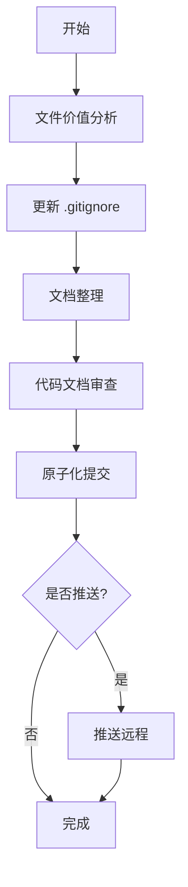

# Workspace Cleanup Workflow

**版本**: v1.0
**所属部门**: office
**类型**: workflow

## 概述

工作区整理工作流是一个完整的自动化流程，用于整理和清理项目工作区。它包含文件价值分析、gitignore 更新、文档整理、代码审查、原子化提交和远程推送等步骤。

## 工作流程



## 工作流阶段

### Stage 1: 文件价值分析

**Agent**: `file-value-analyzer`

- 扫描工作区目录结构
- 识别临时文件、编译产物、IDE 配置等
- 按类别分类（临时文件、构建产物、IDE 文件、OS 文件、依赖、日志、缓存）
- 生成 gitignore 建议

**输出**:
- `workspace-cleanup/file-analysis.yaml`

### Stage 2: 更新 .gitignore

**Skill**: `gitignore-updater`

- 读取现有 .gitignore
- 按类别组织新规则
- 添加注释和分组
- 备份原文件
- 写入更新后的 .gitignore

**输出**:
- `.gitignore` (更新)
- `workspace-cleanup/gitignore-update.yaml`

### Stage 3: 文档整理

**Agent**: `doc-organizer`

- 扫描工作区中的 Markdown 文档
- 分类文档（技术文档、用户文档、开发文档、规范文档、计划文档、归档文档）
- 创建标准目录结构
- 检查并补充元数据（作者、日期、版本号）
- 移动文档到合适的目录

**输出**:
- `workspace-cleanup/doc-organization.yaml`
- 移动和更新的文档文件

### Stage 4: 代码文档审查

**Agent**: `code-doc-reviewer`

- 审查所有代码文件（Python, JavaScript, TypeScript, Java, Go 等）
- 审查所有文档文件
- 识别问题：
  - 代码质量（错误处理、重复代码、复杂度）
  - 文档问题（完整性、准确性、元数据）
  - 架构问题
  - 安全问题
  - 性能问题
  - 可维护性问题
  - 测试问题
- 按严重程度分类（critical, major, minor, trivial）
- 生成技术债文档（YAML + Markdown）

**注意**: 此阶段仅识别问题，不进行修复。

**输出**:
- `tech-debt/tech-debt-{date}.yaml`
- `tech-debt/tech-debt-{date}.md`

### Stage 5: 原子化提交

**Agent**: `git-atomic-committer`

- 分析工作区中的所有更改
- 将相关更改分组
- 为每个逻辑更改创建原子化提交
- 使用 Conventional Commits 格式
- 等待人工审核
- 执行提交

**提交类型**:
- `chore`: .gitignore 更新、目录创建
- `docs`: 文档移动、元数据更新

**输出**:
- `workspace-cleanup/commit-plan.yaml`
- `workspace-cleanup/commit-history.yaml`
- Git 提交记录

### Stage 6: 推送远程

**Skill**: `git-push`

- 等待人工确认
- 执行推送前检查
- 推送提交到远程仓库
- 验证推送结果

**输出**:
- `workspace-cleanup/push-result.yaml`

## 使用方式

### 基本使用

```bash
lee workflow run workflow.office.workspace_cleanup \
  --workspace_path /path/to/your/project \
  --author_name "Your Name"
```

### 整理但不推送

```bash
lee workflow run workflow.office.workspace_cleanup \
  --workspace_path /path/to/your/project \
  --skip_push true
```

### 自定义排除模式

```bash
lee workflow run workflow.office.workspace_cleanup \
  --workspace_path /path/to/your/project \
  --exclude_patterns '["node_modules", ".git", "custom_dir"]'
```

## 输出结构

```
workspace-cleanup/
├── cleanup-summary-{timestamp}.yaml    # 整理汇总报告
├── file-analysis.yaml                  # 文件价值分析
├── gitignore-update.yaml               # gitignore 更新记录
├── doc-organization.yaml               # 文档整理结果
├── commit-plan.yaml                    # 提交规划
├── commit-history.yaml                 # 提交历史
└── push-result.yaml                    # 推送结果

tech-debt/
├── tech-debt-{date}.yaml               # 技术债 YAML
└── tech-debt-{date}.md                 # 技术债 Markdown 报告

docs/
├── technical/                          # 技术文档
├── user/                               # 用户文档
├── development/                        # 开发文档
├── specifications/                     # 规范文档
├── planning/                           # 计划文档
└── archive/                            # 归档文档
```

## 人工审核点

### 1. 提交审核 (Stage 5)

在执行提交前，需要审核提交规划：
- 检查提交分组是否合理
- 检查提交信息是否清晰
- 确认没有敏感信息被提交

### 2. 推送确认 (Stage 6)

在推送到远程前，需要确认：
- 提交内容符合预期
- 推送到正确的分支
- 远程仓库准备就绪

## 注意事项

1. **运行前备份**: 虽然所有操作都通过 Git 可回滚，但建议先在测试分支运行
2. **工作区状态**: 确保工作区没有未保存的重要更改
3. **技术债文档**: 仅记录问题，不会修复代码，需要后续单独处理
4. **提交历史**: 所有更改都会创建 Git 提交，保持历史可追溯
5. **远程推送**: 推送前会要求人工确认，避免误操作

## 适用场景

- 项目初始化后的首次整理
- 定期的工作区清理和维护
- 代码审查前的预处理
- 技术债务盘点
- 文档规范化

## 相关资源

- [工作流规范](./workflow.yaml)
- [File Value Analyzer Agent](../../agents/file-value-analyzer/v1/agent.yaml)
- [Doc Organizer Agent](../../agents/doc-organizer/v1/agent.yaml)
- [Code Doc Reviewer Agent](../../agents/code-doc-reviewer/v1/agent.yaml)
- [Git Atomic Committer Agent](../../agents/git-atomic-committer/v1/agent.yaml)
- [GitIgnore Updater Skill](../../skills/gitignore-updater/v1/skill.yaml)
- [Git Push Skill](../../skills/git-push/v1/skill.yaml)
