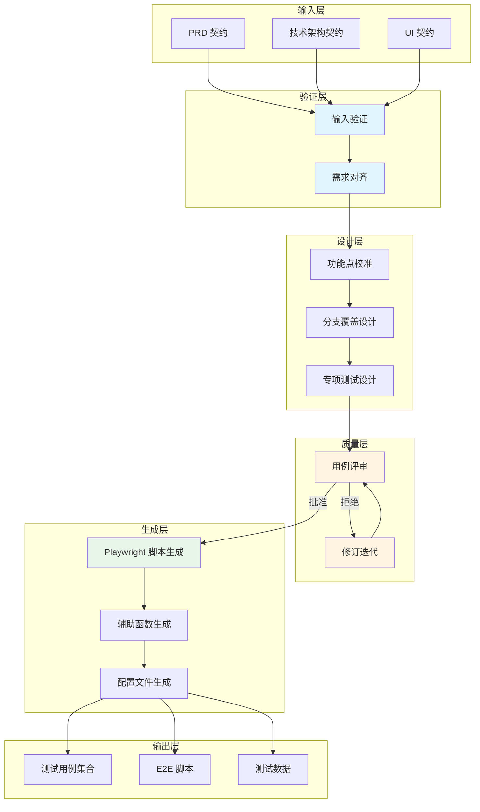
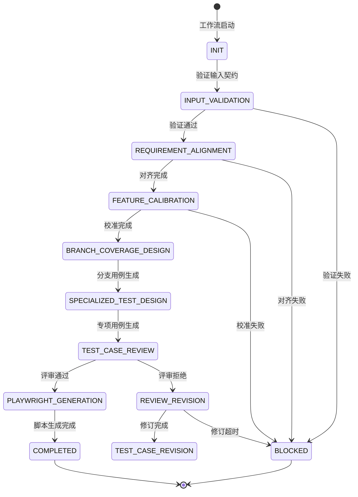
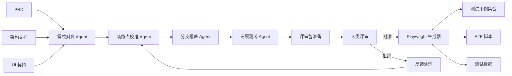

# Test Case Design Pipeline v1.0

## 1. 简介

测试用例设计工作流（Test Case Design Pipeline）是 LEE 框架 QA 部门的核心工作流之一，负责从需求文档到自动化测试脚本的完整转换流程。

### 1.1 核心价值

本工作流实现了以下核心价值：

- **三方一致性验证**：确保 PRD、技术架构文档、UI 契约之间的完全对齐
- **可追溯性**：建立从需求到测试用例的完整追溯链
- **全面覆盖**：通过分支覆盖分析确保测试用例的完整性
- **质量保证**：通过人类评审机制确保测试用例质量
- **自动化生成**：自动生成 Playwright E2E 测试脚本

### 1.2 工作流范围

```
输入：PRD + 技术架构 + UI 契约
  ↓
处理：需求对齐 → 功能点校准 → 分支覆盖设计 → 专项测试设计 → 评审
  ↓
输出：测试用例集合 + Playwright 脚本
```

### 1.3 适用场景

- 新功能的测试用例设计
- 回归测试用例库构建
- E2E 自动化脚本开发
- 测试覆盖率提升项目
- 质量保证体系建设

---

## 2. 架构图

### 2.1 总体架构



### 2.2 状态转换图



### 2.3 数据流图



---

## 3. 核心概念

### 3.1 需求对齐 (Requirement Alignment)

**定义**：验证 PRD、技术架构文档、UI 契约之间的一致性。

**关键属性**：
- `prd_consistency`: PRD 需求完整性检查
- `architecture_coverage`: 架构设计覆盖度验证
- `ui_contract_match`: UI 契约匹配度验证

**输出产物**：
```yaml
# test-case-design/requirement-alignment.yaml
consistency_matrix:
  prd_to_architecture: 95%
  prd_to_ui: 92%
  architecture_to_ui: 88%
  overall_alignment: 92%

gaps_identified:
  - feature: "用户认证流程"
    gap: "PRD 描述的 MFA 支持在架构中未体现"
    severity: "high"
    recommendation: "更新架构文档或调整 PRD"

  - feature: "数据导出功能"
    gap: "UI 缺少导出格式选择界面"
    severity: "medium"
    recommendation: "补充 UI 设计"
```

### 3.2 功能点校准 (Feature Calibration)

**定义**：建立 PRD 功能点与架构组件、UI 页面的映射关系。

**关键属性**：
- `feature_to_component`: 功能点到架构组件映射
- `feature_to_page`: 功能点到 UI 页面映射
- `coverage_gaps`: 覆盖缺口识别

**输出产物**：
```yaml
# test-case-design/feature-calibration.yaml
features:
  - id: "F001"
    name: "用户登录"
    prd_reference: "PRD-2.3.1"
    component_mapping:
      - component: "AuthService"
        module: "authentication"
        coverage: "full"
    page_mapping:
      - page: "/login"
        ui_contract: "login-page-contract"
        coverage: "full"
    test_priority: "critical"

coverage_matrix:
  total_features: 45
  covered_features: 43
  coverage_percentage: 95.6%
  uncovered_features:
    - id: "F044"
      name: "高级搜索"
      reason: "UI 设计未完成"
```

### 3.3 分支覆盖 (Branch Coverage)

**定义**：基于用户流程和决策点设计分支测试用例。

**关键属性**：
- `decision_points`: 决策点识别
- `user_flows`: 用户流程路径
- `branch_cases`: 分支用例集合

**决策点识别示例**：
```yaml
# test-case-design/decision-points.yaml
decision_tree:
  flow_id: "UF001"
  flow_name: "用户注册流程"
  decision_points:
    - id: "DP001"
      location: "注册表单提交"
      condition: "邮箱格式验证"
      branches:
        - branch: "valid_email"
          outcome: "进入密码设置"
          probability: 0.85
        - branch: "invalid_email"
          outcome: "显示错误提示"
          probability: 0.15
      edge_cases:
        - "邮箱为空"
        - "邮箱格式错误"
        - "邮箱已注册"
```

**分支用例示例**：
```yaml
# test-cases/functional/branch-coverage/flow-UF001/branch-DP001.yaml
test_case:
  id: "TC-UF001-DP001-B01"
  name: "有效邮箱注册"
  flow: "用户注册流程"
  decision_point: "邮箱格式验证"
  branch: "valid_email"

  prerequisites:
    - user_not_registered: true
    - email_format: valid

  test_steps:
    - step: 1
      action: "打开注册页面"
      expected: "显示注册表单"
    - step: 2
      action: "输入有效邮箱 test@example.com"
      expected: "邮箱字段接受输入"
    - step: 3
      action: "提交表单"
      expected: "进入密码设置页面"

  test_data:
    email: "test@example.com"
    expected_status_code: 200

  priority: "high"
  automation: "playwright"
```

### 3.4 专项测试 (Specialized Testing)

**定义**：设计性能、安全、可访问性等专项测试用例。

**类型**：
1. **性能测试**
   - 负载测试（Load Testing）
   - 压力测试（Stress Testing）
   - 延迟测试（Latency Testing）
   - 扩展性测试（Scalability Testing）

2. **安全测试**
   - 认证测试（Authentication）
   - 授权测试（Authorization）
   - 注入攻击测试（Injection Attacks）
   - OWASP Top 10 测试

3. **可访问性测试**
   - WCAG 合规性测试
   - 屏幕阅读器测试
   - 键盘导航测试
   - 颜色对比度测试

**示例**：
```yaml
# test-cases/performance/load-tests.yaml
performance_test:
  id: "PERF-001"
  name: "并发用户登录性能测试"
  type: "load_test"

  test_scenario:
    virtual_users: 1000
    ramp_up_time: "5m"
    test_duration: "30m"
    think_time: "2s"

  sla_requirements:
    - metric: "response_time_p95"
      threshold: "2000ms"
    - metric: "error_rate"
      threshold: "0.1%"
    - metric: "throughput"
      threshold: "100 req/s"

  test_data:
    user_pool_size: 10000
    concurrent_requests: 1000
```

### 3.5 用例评审 (Case Review)

**定义**：人类介入评审测试用例，确保质量和覆盖度。

**评审标准**：
- `coverage_completeness`: 覆盖度完整性 >= 90%
- `case_quality`: 用例质量评分 >= 8/10
- `traceability`: 需求可追溯性 100%
- `risk_mitigation`: 高风险点覆盖 100%

**批准链条**：
- QA Lead（必需）
- Tech Lead（可选）
- PM（可选）

**评审反馈格式**：
```yaml
# review/test-case-review-feedback.yaml
review_feedback:
  review_id: "REV-001"
  reviewer: "qa_lead"
  review_date: "2026-02-04"
  decision: "rejected"

  feedback_items:
    - category: "coverage"
      severity: "major"
      description: "缺少异常场景测试用例"
      affected_cases:
        - "TC-UF001"
      suggested_fix: "添加网络错误、服务器错误等异常场景用例"

  required_changes:
    - case_id: "TC-UF001"
      change_type: "add"
      description: "添加网络超时测试用例"
    - case_id: "TC-UF002"
      change_type: "modify"
      description: "增加错误码验证步骤"

  revision_deadline: "2026-02-06T18:00:00Z"
```

### 3.6 脚本生成 (Script Generation)

**定义**：基于 UI 契约和测试用例生成 Playwright 脚本。

**生成内容**：
1. **测试规范（Specs）**
   - Smoke 测试
   - 功能测试
   - 分支覆盖测试
   - 专项测试

2. **辅助函数（Helpers）**
   - 页面对象（Page Objects）
   - API 辅助函数
   - 测试数据辅助函数
   - 断言辅助函数

3. **配置文件（Config）**
   - Playwright 配置
   - 环境配置
   - 测试配置

**示例**：
```typescript
// e2e-scripts/playwright/specs/smoke/authentication.spec.ts
import { test, expect } from '@playwright/test';
import { LoginPage } from '../../helpers/page-objects';

test.describe('Authentication Smoke Tests', () => {
  let loginPage: LoginPage;

  test.beforeEach(async ({ page }) => {
    loginPage = new LoginPage(page);
    await loginPage.navigate();
  });

  test('TC-UF001: Valid user login', async ({ page }) => {
    // Test data from test-cases/functional/smoke/login.yaml
    const userData = {
      email: 'test@example.com',
      password: 'SecurePass123!'
    };

    await loginPage.login(userData);
    await expect(page).toHaveURL(/dashboard/);
  });
});
```

---

## 4. 文件结构

### 4.1 工作流目录结构

```
test-case-design-pipeline/
├── v1/
│   ├── workflow.yaml              # 主工作流定义
│   ├── README.md                  # 本文档
│   ├── agents/                    # Agent 定义
│   │   ├── requirement-alignment-agent.yaml
│   │   ├── feature-calibration-agent.yaml
│   │   ├── branch-coverage-agent.yaml
│   │   ├── specialized-test-agent.yaml
│   │   └── playwright-script-generator.yaml
│   ├── skills/                    # Skill 定义
│   │   ├── ui-contract-analyzer.yaml
│   │   ├── branch-coverage-analyzer.yaml
│   │   └── playwright-code-generator.yaml
│   └── gates/                     # 门禁定义
│       ├── design-input-gate.yaml
│       └── test-case-review-gate.yaml
```

### 4.2 输出产物结构

```
delivery/test-case-design-package/
├── README.md                      # 包说明文档
├── delivery-manifest.yaml         # 交付清单
├── metrics.yaml                   # 质量指标
│
├── test-case-design/              # 设计文档
│   ├── requirement-alignment.yaml
│   ├── feature-calibration.yaml
│   ├── branch-coverage.yaml
│   └── specialized-tests.yaml
│
├── test-cases/                    # 测试用例
│   ├── functional/
│   │   ├── smoke/
│   │   ├── core-flow/
│   │   └── branch-coverage/
│   │       └── flow-{flow-id}/
│   │           ├── main-path.yaml
│   │           ├── branch-{branch-id}.yaml
│   │           └── edge-cases.yaml
│   ├── performance/
│   │   ├── load-tests.yaml
│   │   ├── stress-tests.yaml
│   │   └── latency-tests.yaml
│   ├── security/
│   │   ├── authentication.yaml
│   │   ├── authorization.yaml
│   │   └── owasp-top10.yaml
│   └── accessibility/
│       ├── wcag-compliance.yaml
│       └── keyboard-navigation.yaml
│
├── e2e-scripts/                   # Playwright 脚本
│   ├── playwright/
│   │   ├── specs/
│   │   │   ├── smoke/
│   │   │   ├── functional/
│   │   │   └── specialized/
│   │   ├── helpers/
│   │   │   ├── page-objects.ts
│   │   │   ├── api-helpers.ts
│   │   │   └── assertion-helpers.ts
│   │   └── config/
│   │       ├── playwright.config.ts
│   │       └── environments.ts
│   └── test-data/
│       ├── users.json
│       └── scenarios.json
│
└── review/                        # 评审产物
    ├── test-case-review-package.yaml
    ├── test-case-review-approval.yaml
    └── test-case-review-feedback.yaml
```

---

## 5. 快速开始

### 5.1 最简使用示例

```bash
# 1. 准备输入契约
export PRD_CONTRACT="path/to/prd-contract.yaml"
export ARCH_CONTRACT="path/to/architecture-contract.yaml"
export UI_CONTRACT="path/to/ui-contract.yaml"

# 2. 启动工作流
lee workflow start \
  --workflow workflow.qa.test_case_design_pipeline \
  --input prd=$PRD_CONTRACT \
  --input technical_architecture=$ARCH_CONTRACT \
  --input ui_prototype=$UI_CONTRACT \
  --input ui_page=$UI_CONTRACT

# 3. 监控进度
lee workflow status --workflow <workflow-id>

# 4. 评审阶段（人类介入）
lee workflow review --workflow <workflow-id> \
  --role qa_lead \
  --decision approve

# 5. 获取产物
lee workflow artifacts --workflow <workflow-id> \
  --output ./delivery/
```

### 5.2 分步执行示例

```bash
# 步骤 1: 验证输入
lee stage execute \
  --workflow <workflow-id> \
  --stage s1_input_validation

# 步骤 2: 需求对齐
lee stage execute \
  --workflow <workflow-id> \
  --stage s2_requirement_alignment

# 步骤 3: 功能点校准
lee stage execute \
  --workflow <workflow-id> \
  --stage s3_feature_calibration

# 步骤 4: 分支覆盖设计
lee stage execute \
  --workflow <workflow-id> \
  --stage s4_branch_coverage

# 步骤 5: 专项测试设计
lee stage execute \
  --workflow <workflow-id> \
  --stage s5_specialized_tests

# 步骤 6: 提交评审
lee stage execute \
  --workflow <workflow-id> \
  --stage s6_test_case_review

# 步骤 7: 生成 Playwright 脚本
lee stage execute \
  --workflow <workflow-id> \
  --stage s7_playwright_generation
```

### 5.3 Python SDK 示例

```python
from lee.client import WorkflowClient
from lee.models import WorkflowInput

# 初始化客户端
client = WorkflowClient(endpoint="http://lee-api:8080")

# 准备输入
inputs = WorkflowInput(
    prd="path/to/prd-contract.yaml",
    technical_architecture="path/to/architecture-contract.yaml",
    ui_prototype="path/to/ui-contract.yaml",
    ui_page="path/to/ui-page-contract.yaml"
)

# 启动工作流
workflow = client.start_workflow(
    workflow_id="workflow.qa.test_case_design_pipeline",
    inputs=inputs,
    options={
        "auto_review": False,  # 需要人类评审
        "playwright_version": "1.40.0"
    }
)

# 等待评审阶段
workflow.wait_for_stage("s6_test_case_review")

# 执行评审
review_decision = client.review_workflow(
    workflow_id=workflow.id,
    reviewer_role="qa_lead",
    decision="approve",
    comments="测试用例覆盖完整，质量良好"
)

# 继续执行到完成
workflow.continue_after_review()

# 获取产物
artifacts = workflow.get_artifacts()
artifacts.download("./delivery/")
```

---

## 6. 配置选项

### 6.1 工作流级别配置

```yaml
# workflow 配置段
config:
  # 评审配置
  review:
    enabled: true
    timeout: "72h"
    required_approvers:
      - qa_lead
    optional_approvers:
      - tech_lead
      - pm

  # Playwright 生成配置
  playwright:
    version: "1.40.0"
    language: "typescript"
    framework: "jest"
    browsers:
      - chromium
      - firefox
      - webkit
    generate_helpers: true
    generate_test_data: true

  # 覆盖率配置
  coverage:
    requirement_target: 90
    feature_target: 95
    ui_page_target: 100
    branch_coverage_depth: 3

  # 质量配置
  quality:
    min_quality_score: 8
    traceability_required: true
    clarity_threshold: 90

  # 自动化配置
  automation:
    target_automation_rate: 70
    playwright_coverage_target: 60
```

### 6.2 Agent 配置

```yaml
# requirement-alignment-agent 配置
agent:
  requirement_alignment_agent:
    model: "claude-3-opus"
    temperature: 0.3
    max_tokens: 4000
    tools:
      - "prd_analyzer"
      - "architecture_analyzer"
      - "ui_contract_analyzer"

  feature_calibration_agent:
    model: "claude-3-sonnet"
    temperature: 0.2
    max_tokens: 8000
    tools:
      - "feature_extractor"
      - "component_mapper"
      - "page_mapper"

  branch_coverage_agent:
    model: "claude-3-opus"
    temperature: 0.4
    max_tokens: 6000
    tools:
      - "flow_analyzer"
      - "decision_point_extractor"
      - "branch_generator"

  specialized_test_agent:
    model: "claude-3-sonnet"
    temperature: 0.3
    max_tokens: 6000
    specialization:
      - "performance"
      - "security"
      - "accessibility"

  playwright_script_generator:
    model: "claude-3-opus"
    temperature: 0.1
    max_tokens: 12000
    tools:
      - "typescript_generator"
      - "playwright_best_practices"
      - "test_data_generator"
```

### 6.3 门禁配置

```yaml
# design-input-gate 配置
gate:
  design_input_gate:
    strict_mode: true
    validation_rules:
      - rule: "prd_must_be_frozen"
        check: "prd.status == 'frozen'"
        error_message: "PRD 必须已冻结"

      - rule: "architecture_must_be_frozen"
        check: "technical_architecture.status == 'frozen'"
        error_message: "技术架构必须已冻结"

      - rule: "ui_contract_must_exist"
        check: "ui_page != null"
        error_message: "UI 页面契约必须存在"

      - rule: "no_conflicts"
        check: "consistency_matrix.conflicts == 0"
        error_message: "存在未解决的需求冲突"
        severity: "blocker"

# test-case-review-gate 配置
  test_case_review_gate:
    approval_criteria:
      coverage_completeness:
        threshold: 90
        metric: "feature_coverage_percentage"

      case_quality:
        threshold: 8
        metric: "average_case_quality_score"
        scale: "1-10"

      traceability:
        threshold: 100
        metric: "requirement_traceability_percentage"

    feedback_format:
      feedback_items:
        - category: "string"
        - severity: "critical|major|minor"
        - description: "string"
        - affected_cases: "array"
        - suggested_fix: "string"
```

### 6.4 环境变量配置

```bash
# .env 文件
LEE_WORKFLOW_TIMEOUT=86400           # 工作流超时时间（秒）
LEE_REVIEW_TIMEOUT=259200            # 评审超时时间（秒）
LEE_MAX_REVISION_COUNT=3             # 最大修订次数
LEE_PLAYWRIGHT_VERSION=1.40.0        # Playwright 版本
LEE_DEFAULT_BROWSER=chromium         # 默认浏览器
LEE_HEADLESS_MODE=true               # 无头模式
LEE_PARALLEL_EXECUTION=true          # 并行执行
LEE_MAX_WORKERS=4                    # 最大工作进程数
LEE_ARTIFACT_RETENTION_DAYS=30       # 产物保留天数
LEE_NOTIFICATION_ENABLED=true        # 通知启用
LEE_SLACK_WEBHOOK_URL=https://hooks.slack.com/...  # Slack Webhook
```

---

## 7. 质量标准

### 7.1 覆盖率标准

| 指标 | 目标值 | 测量方法 | 说明 |
|------|--------|----------|------|
| **需求覆盖率** | >= 90% | (已覆盖需求数 / 总需求数) × 100% | 每个 PRD 需求至少对应一个测试用例 |
| **功能点覆盖率** | >= 95% | (已覆盖功能点数 / 总功能点数) × 100% | 每个功能点至少对应一个测试用例 |
| **UI 页面覆盖率** | 100% | (已测试页面数 / 总页面数) × 100% | 所有 UI 页面必须有测试用例 |
| **分支覆盖率** | >= 85% | (已测试分支数 / 总分支数) × 100% | 决策点的所有分支必须测试 |
| **代码覆盖率** | >= 70% | (已执行代码行数 / 总代码行数) × 100% | 通过 Playwright 脚本执行测量 |

### 7.2 用例质量标准

| 质量维度 | 评分标准 | 权重 |
|----------|----------|------|
| **清晰度** | 步骤明确，无歧义 | 25% |
| **可执行性** | 可直接执行，无需额外说明 | 25% |
| **可维护性** | 结构清晰，易于更新 | 20% |
| **可追溯性** | 关联需求 ID 和功能点 | 15% |
| **数据完整性** | 包含完整的测试数据 | 15% |

**综合质量评分计算**：
```
总分 = 清晰度 × 0.25 + 可执行性 × 0.25 + 可维护性 × 0.20
     + 可追溯性 × 0.15 + 数据完整性 × 0.15

目标：总分 >= 8.0 / 10.0
```

### 7.3 自动化标准

| 自动化指标 | 目标值 | 说明 |
|-----------|--------|------|
| **可自动化率** | >= 70% | 可自动化的用例占比 |
| **Playwright 覆盖率** | >= 60% | 生成 Playwright 脚本的用例占比 |
| **执行稳定性** | >= 95% | 自动化脚本首次执行通过率 |
| **维护成本** | 低 | 每次迭代需要修改的脚本 < 10% |

### 7.4 性能标准

| 性能指标 | 目标值 | 测试类型 |
|----------|--------|----------|
| **响应时间（P95）** | < 2s | 正常负载 |
| **响应时间（P99）** | < 5s | 正常负载 |
| **并发用户数** | >= 1000 | 负载测试 |
| **错误率** | < 0.1% | 压力测试 |
| **吞吐量** | >= 100 req/s | 负载测试 |

### 7.5 安全标准

| 安全指标 | 要求 | 测试类型 |
|----------|------|----------|
| **OWASP Top 10** | 100% 覆盖 | 安全测试 |
| **认证测试** | 全覆盖 | 安全测试 |
| **授权测试** | 全覆盖 | 安全测试 |
| **注入攻击** | 全覆盖 | 安全测试 |
| **数据保护** | 符合 GDPR/隐私法 | 合规测试 |

### 7.6 可访问性标准

| 可访问性指标 | 要求 | 测试类型 |
|-------------|------|----------|
| **WCAG 2.1 AA** | 100% 合规 | 可访问性测试 |
| **键盘导航** | 全功能可用 | 可访问性测试 |
| **屏幕阅读器** | 兼容主流阅读器 | 可访问性测试 |
| **颜色对比度** | 符合 WCAG 标准 | 可访问性测试 |
| **替代文本** | 所有图片有 alt | 可访问性测试 |

---

## 8. 版本历史

### v1.0 (2026-02-04)

**初始版本**

**新增功能**：
- ✨ 需求对齐功能
  - PRD、架构、UI 三方一致性验证
  - 冲突识别和解决建议
  - 一致性矩阵生成

- ✨ 功能点校准功能
  - 功能点提取和分类
  - 功能点到组件映射
  - 功能点到页面映射
  - 覆盖缺口识别

- ✨ 分支覆盖设计功能
  - 用户流程识别
  - 决策点提取
  - 分支用例生成
  - 边界情况识别

- ✨ 专项测试设计功能
  - 性能测试用例生成
  - 安全测试用例生成
  - 可访问性测试用例生成

- ✨ 用例评审功能
  - 人类评审机制
  - 评审标准定义
  - 反馈格式化
  - 修订迭代支持

- ✨ Playwright 脚本生成功能
  - 测试规范生成
  - 辅助函数生成
  - 配置文件生成
  - 测试数据生成

**已知限制**：
- 仅支持 PRD、架构、UI 契约的 YAML 格式
- Playwright 版本固定为 1.40.0
- 评审仅支持单轮修订

**计划改进**：
- [ ] 支持多种契约格式（JSON、TOML）
- [ ] 支持多轮评审迭代
- [ ] 增加测试用例优先级自动排序
- [ ] 支持测试数据动态生成
- [ ] 集成 CI/CD 流程

---

## 9. 附录

### 9.1 相关文档

- [LEE 框架总览](../../../README.md)
- [QA 部门文档](../../README.md)
- [测试用例设计契约](../../contracts/test-case-design-contract/v1/README.md)
- [测试用例契约](../../contracts/test-case/v1/README.md)
- [E2E 脚本契约](../../contracts/e2e-script-contract/v1/README.md)

### 9.2 相关工具

- [LIA CLI 文档](https://lee-framework.dev/docs/cli)
- [LIA Python SDK](https://lee-framework.dev/docs/sdk/python)
- [Playwright 官方文档](https://playwright.dev/docs/intro)

### 9.3 联系方式

- **QA 团队**: qa-team@company.com
- **技术支持**: lee-support@company.com
- **问题反馈**: [GitHub Issues](https://github.com/company/lee/issues)

### 9.4 许可证

Copyright © 2026 LEE Framework. All rights reserved.

---

**文档版本**: 1.0.0
**最后更新**: 2026-02-04
**维护者**: QA Design Team
